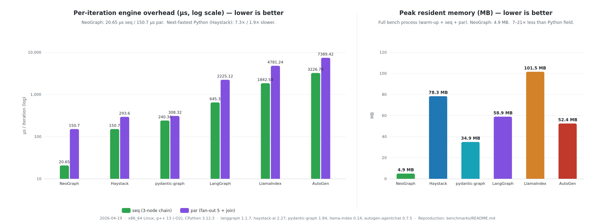

<!-- neograph-i18n: source=benchmarks/README.md locale=zh-CN source_sha256=d0a5deba1ae20473d11d5dd6385d0966e7d08ab563f333f5730751dfeb994466 -->
# NeoGraph 对比 Python 图/流水线框架 — 引擎开销基准测试

**Languages:** [English](README.md) | [한국어](README.ko.md) | [日本語](README.ja.md) | [简体中文](README.zh-CN.md)

在形状完全相同、且 **没有 I/O、没有 sleep、没有 LLM 调用** 的图上，测量 NeoGraph 相对于主流 Python 编排框架的每次调用开销。这些数字反映的是引擎自身的成本（节点调度、状态通道写入、reducer 调用），不是任何模拟工作的延迟。

比较的框架：

| 框架 | 版本 | 抽象层 |
|-----------|---------|-------------|
| NeoGraph | 3.0 (`feat/taskflow-removal`) | 状态通道图，C++20 协程 + asio |
| LangGraph | 1.1.9 | 状态通道图（Python） |
| Haystack | 2.27 | 带类型化 socket 的组件流水线 |
| pydantic-graph | 1.84 | 单一下一节点状态机 |
| LlamaIndex Workflow | 0.14 | 事件驱动异步 workflow |
| AutoGen GraphFlow | 0.7.5 | 消息传递式多智能体图 |

## 工作负载

六个实现都定义完全相同的两个图，编译一次（适用时），然后在热循环中调用。

| Id | Shape | State |
|----|-------|-------|
| `seq` | 3 节点链 `a → b → c` | 单个 `counter` 通道，每个节点写入 `counter+1`（覆盖 reducer） |
| `par` | fan-out 5 个 worker，然后在 `summarizer` 汇合 | `results: list`（append reducer）+ `count: int`；每个 worker 追加自己的索引，summarizer 写入 `len(results)` |

所有框架都关闭 checkpointing。

按框架翻译 workload 形状时需要两个移植点：

* **Haystack** 没有 append reducer — 每个 worker 通过自己的类型化 socket 发出结果，summarizer 对列表长度求和。每次运行调度的组件数量相同。
* **pydantic-graph** 是单一下一节点状态机，不能 fan out。`par` workload 被模拟为 6 节点串行链（`w1 → w2 → w3 → w4 → w5 → summ`）。结果中已标注 — 这不是 apples-to-apples 的并行 fan-out 测量。
* **AutoGen** 是消息传递模型，不是状态通道模型。counter 被编码成文本消息内容。summarizer 统计传入的 worker 消息。图形状相同，状态模型不同。

## 结果

下面的 **reference run** 于 2026-04-22 测得，使用 x86_64 Linux 上的 NeoGraph v3.0.0，g++ 13 Release `-O3 -DNDEBUG`，CPython 3.12.3。NeoGraph：`bench_neograph` 的 10 次运行中位数。Python 字段：每个框架 3 次运行中位数。版本：neograph v3.0.0，langgraph 1.1.9，haystack-ai 2.28.0，pydantic-graph 1.85.1，llama-index-core 0.14.21，autogen-agentchat 0.7.5。

下面还包含对当时 current master 的重新测量（2026-04-29），位于 reference run 之后。`par` 行明确报告两个受支持的执行机制：当前默认的 `worker_count=1`，以及通过 `set_worker_count_auto()` 启用的引擎自有池。为什么没有 I/O 的微基准应把这些数字分开，请见表后的 *Notes*。



### 每次迭代开销（µs，越低越好）

| 框架 | `seq`（3 节点链） | `par`（5 路 fan-out + 汇合） | `seq` 对比 NeoGraph | `par` 对比 NeoGraph |
|-----------|---------------------:|-------------------------:|-------------------:|-------------------:|
| **NeoGraph v3.0.0** *(基准，2026-04-22)* | **5.0** | **11.8** | 1× | 1× |
| **NeoGraph master** *(2026-04-29，默认 `worker_count=1`)* | **5.25** | **14.4** | 1× | 1× |
| **NeoGraph master** *(2026-04-29，`set_worker_count_auto()`)* | **5.25** | **278** | 1× | 1× |
| Haystack 2.28.0 | 139.85 | 278.48 | 28.0× / 26.6× / 26.6× | 23.6× / 19.3× / 1.0× |
| pydantic-graph 1.87.0 | 227.14 | 280.26¹ | 45.4× / 43.3× / 43.3× | 23.7×¹ / 19.5×¹ / 1.0×¹ |
| LangGraph 1.1.10 | 642.62 | 2,261.55 | 128.5× / 122.4× / 122.4× | 191.7× / 157.1× / 8.1× |
| LlamaIndex Workflow 0.14.21 | 1,564.54 | 4,373.76 | 312.9× / 298.0× / 298.0× | 370.7× / 303.7× / 15.7× |
| AutoGen GraphFlow 0.7.5 | 3,126.86 | 7,281.08 | 625.4× / 595.6× / 595.6× | 617.0× / 505.6× / 26.2× |

最右两列显示三个比值：相对于 v3.0.0 reference / 相对于 master worker=1 default / 相对于 master auto-worker mode。

2026-04-29 的重新测量（上表）在每一行都复现了 2026-04-22 reference，误差在 ±10 % 以内 — 同一台机器、同一套工具链、同一 workload。README 的 headline claims（`seq` 上 LangGraph 130×、AutoGen 600×）在 master HEAD 上仍然成立。

¹ pydantic-graph 的 `par` 是串行 6 节点模拟 — 它不支持 fan-out。它不是并行 workload；为完整性而列出。

### 关于 `par` 行的说明（`seq` 不变）

`par` 的 14.4 → 278 µs 差距，是为五个不做真实工作的节点选择引擎自有线程池时测得的成本：

* **当前 `build()` / `compile()` 默认值：`worker_count=1`。** 不安装引擎自有池，因此 fan-out 在调用方 executor 上调度。这就是 14.4 µs 行，也是 CPU 极小节点或节点持有非线程安全状态的图应关注的正确回归信号。
* **并行 fan-out 是显式启用的。** `set_worker_count_auto()` 把池大小设为 `hardware_concurrency`；`set_worker_count(N)` 选择固定上限。这就是 278 µs 行。由于每个 worker 只追加一个整数，这里的协调成本很明显；但相对于 100 ms LLM 调用可以忽略，并允许独立节点重叠执行。

无需修改基准源码即可运行两种机制：

```bash
./build/bench_neograph 10000 5000 1
./build/bench_neograph 10000 5000 auto
```

第三个参数应用于 `par` 引擎，接受 `1`（默认）、`auto` 或任意正 worker 数。输出包含 `config\tpar_workers\t...` 行，因此保存的结果会保留其执行模式。

headline 仍然成立：NeoGraph 在表中每一行都获胜，根据框架和配置不同，优势为 8×–600×。"`par` 上比 LangGraph 快 199×" 的 reference 在 2026-04-29 的 worker=1 测量中是 163×；auto-worker mode 用微基准开销换取阻塞节点或 CPU-bound 节点中的真实并发。

### 端到端进程指标

整个二进制/脚本的运行时间，包含 warm-up + 两个 workloads。`seq` = 10,000 iters，`par` = 5,000 iters。使用 `/usr/bin/time -f "%e s, %M KB"` 测量。

| 框架 | 总耗时 | 峰值 RSS | 执行器 |
|-----------|--------------:|---------:|---------:|
| **NeoGraph 3.0** | **0.11 s** | **4.5 MB** | 默认单线程 io_context |
| pydantic-graph | 3.98 s | 35.1 MB | 单线程 asyncio（GIL） |
| Haystack | 3.85 s | 80.3 MB | 单线程 asyncio（GIL） |
| LangGraph | 18.95 s | 60.1 MB | 单线程 asyncio（GIL） |
| LlamaIndex Workflow | 39.49 s | 101.4 MB | 单线程 asyncio（GIL） |
| AutoGen GraphFlow | 63.29 s | 52.3 MB | 单线程 asyncio（GIL） |

NeoGraph 3.0 的默认 super-step loop 通过 `run_sync` 在单线程 io_context 上运行协程；CPU 并行 fan-out 通过 `engine->set_worker_count(N)` 显式选择。对于 I/O-bound 节点 workloads，单线程仍然可以通过 co_await suspension 实现重叠。

## Linux ARM64 基线：Neoverse-N1

这是来自 [#165](https://github.com/fox1245/NeoGraph/issues/165) 的独立原生 ARM64 平台 baseline，不是与上方 x86_64 表的回归比较。它固定到 revision `d7a6477` 及其自己的依赖集合，以便后续测量仍然可归因。

| 项目 | 值 |
|---|---|
| 日期 | 2026-07-22 |
| 操作系统 | Ubuntu 24.04, Linux `6.17.0-1018-oracle` |
| 架构 | `aarch64` |
| CPU | 4 vCPU, ARM Neoverse-N1 |
| 内存 | 23 GiB, 无 swap |
| 编译器 / CMake | GCC 13.3.0 / CMake 3.28.3 |
| Python | CPython 3.12.3 |
| NeoGraph revision | `d7a6477` |

workload 和迭代次数与主基准一致：每个图编译一次后运行 10,000 次 `seq` 迭代和 5,000 次 `par` 迭代。NeoGraph 测量 10 次，每个 Python 实现测量 3 次；表中报告中位数。Checkpointing、网络 I/O、模型调用和 sleeps 均已禁用。整进程 peak RSS 来自 `/usr/bin/time -f "%e s, %M KB"`。

| 框架 | `seq`（µs/iter） | `par`（µs/iter） | `seq` 对比 NeoGraph | `par` 对比 NeoGraph | 峰值 RSS |
|---|---:|---:|---:|---:|---:|
| **NeoGraph** | **9.50** | **21.80** | 1× | 1× | **4.35 MB** |
| Haystack 3.0.0 | 153.44 | 329.67 | 16.2× | 15.1× | 73.6 MB |
| pydantic-graph 1.87.0 | 342.60 | 405.87¹ | 36.1× | 18.6×¹ | 32.1 MB |
| LangGraph 1.2.9 | 1,037.55 | 3,289.22 | 109.2× | 150.9× | 63.7 MB |
| LlamaIndex 0.14.23 | 2,765.04 | 7,824.85 | 291.1× | 358.9× | 96.9 MB |
| AutoGen 0.7.5 | 4,166.39 | 9,571.11 | 438.6× | 439.0× | 47.8 MB |

NeoGraph 使用 worker=1 默认值，因此 `par` 行测量的是拓扑、reducer 和串行调度开销，而不是引擎自有线程池执行。若要单独测量并行 fan-out，请使用显式 `auto` benchmark mode；不要把两种模式合并成一个 headline。

¹ pydantic-graph 无法建模这种 fan-out 拓扑；它的 `par` 行是上文描述的同一个串行六节点模拟。固定使用版本 1.87.0，是因为当时 current 的 2.15.0 API 已不再支持该基准的 `Graph(...)` 构造函数。进程未做 CPU-pinning，也未做 cgroup-constrained。

## 这些数字的含义

1. **Python 阵营的每次运行引擎开销跨度约为 ~29× 到 ~642×。** Haystack 是最轻量的竞争者（带类型化 socket 的 DAG，运行时最小）；即便如此，它每个 seq iter 的成本仍比 NeoGraph 高 28.8×。另一端，AutoGen 是 NeoGraph 成本的 642×，原因是它每次运行都要设置多智能体状态。
2. **NeoGraph 3.0 在两个维度上都优于 2.0。** 将 sync 和 async 合并到同一条协程路径并没有让引擎开销回退 — Release 构建中完整协程机制（`run_sync` + 每次调用的 io_context）低于 5 µs，而 2.0 宣称的 sync Taskflow 路径为 20.65 µs。
3. **内存占用对 NeoGraph 有一个数量级或更大的优势。** 4.8 MB（NeoGraph）对比 Python 阵营的 35–101 MB。在 SBC 级目标（Raspberry Pi 级 RAM）上，这是关键指标 — 区别在于"轻松运行"和"谨慎运行"。
4. **3.0 中并行 fan-out 是 opt-in。** NeoGraph 2.x 默认交付 Taskflow 的 work-stealing pool。3.0 默认交付协程路径（单线程调度，便宜），并通过 `engine->set_worker_count(N)` 暴露多线程池作为 opt-in — 这对 I/O-bound（LLM 延迟占主导）的 agent workloads 是正确默认值，否则会支付线程创建开销却没有加速。

## 注意事项 — 此基准未测量的内容

* **真实 agent workloads。** LLM 主导的流水线瓶颈在 provider latency（每次调用 100ms–10s）。在该尺度下，引擎开销会消失。心智模型：NeoGraph 3.0 约 5 µs/call，Haystack 约 144 µs，LangGraph 约 657 µs，LlamaIndex/AutoGen 约 2–7 ms — 相比 500 ms API round trip 都不可见。这个 bench 对非 LLM 节点、密集 agent 编排和启动开销重的部署有意义。
* **Framework-appropriate workloads。** AutoGen、LlamaIndex 和 pydantic-graph 各自优化不同范式（multi-agent chat、event-driven long-running workflows、state-machine control flow），本 bench 没有覆盖这些场景。我们是在 NeoGraph 的主场上测量它们。
* **Checkpoint throughput。** 如果在每个框架上启用 persistence，serialization cost 会占主导；那是另一个 benchmark。
* **Cold start。** 每个实现都在测量前包含 10-iter warm-up loop。整进程数字包含 Python 解释器启动（约 200ms）和框架 import 时间，差异很大（LlamaIndex 和 AutoGen import 大量 trees）。
* **Fairness。** NeoGraph 使用 CMake `-DCMAKE_BUILD_TYPE=Release` 构建，在 GCC 上解析为 `-O3 -DNDEBUG`。每个 Python 框架都是 stock CPython 3.12，加上当前 pip 安装版本 — 这是典型生产部署，没有自定义调优。历史说明：3.0 之前的 README 写的是 `-O2`，因为那是独立 bench 命令使用的选项；CMake build 的 `Release` 一直解析为 `-O3`。

## 复现

```bash
# Build NeoGraph (Release — MUST set BUILD_TYPE explicitly; the
# empty default configures the build without -O3):
cmake -B build -DCMAKE_BUILD_TYPE=Release -DNEOGRAPH_BUILD_BENCHMARKS=ON
cmake --build build --target bench_neograph -j

./build/bench_neograph                   # defaults: seq=10000, par=5000

# Shared Python venv for every Python framework:
python3 -m venv /tmp/bench_venv
/tmp/bench_venv/bin/pip install \
    langgraph \
    haystack-ai \
    pydantic-graph \
    llama-index-core \
    "autogen-agentchat" "autogen-core" "autogen-ext"

# Run each bench (10k seq + 5k par matches the C++ side):
/tmp/bench_venv/bin/python benchmarks/bench_langgraph.py      10000 5000
/tmp/bench_venv/bin/python benchmarks/bench_haystack.py       10000 5000
/tmp/bench_venv/bin/python benchmarks/bench_pydantic_graph.py 10000 5000
/tmp/bench_venv/bin/python benchmarks/bench_llamaindex.py     10000 5000
/tmp/bench_venv/bin/python benchmarks/bench_autogen.py        10000 5000

# Peak RSS + wall time:
/usr/bin/time -f "%e s, %M KB" ./build/bench_neograph
```

两边的输出格式都是 `workload<TAB>iters<TAB>total_ms<TAB>per_iter_us`，因此 diff 很直接。

## 2026-04-19 数字所用的环境

```
OS:        Linux 6.6.87.2-microsoft-standard-WSL2 (Ubuntu 24.04 userland)
CPU:       host CPU (8 logical cores exposed to WSL)
Compiler:  g++ 13.x, -std=c++20 -O2 -DNDEBUG
Python:    3.12.3 (system)
Versions:  langgraph 1.1.7, haystack-ai 2.27.0, pydantic-graph 1.84.1,
           llama-index-core 0.14.20, autogen-agentchat 0.7.5
```

数字会随硬件变化，但比值应能稳定在 ~20% 以内。
