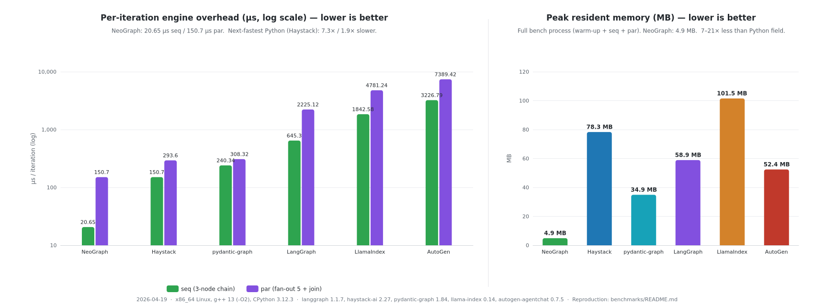

<!-- neograph-i18n: source=benchmarks/README.md locale=zh-CN source_sha256=6ee5c1de3180f83f2256f69f39c08ae0d963a5f6408e99deebdcff999f47b633 -->
# NeoGraph 对比 Python 图/流水线框架 — 引擎开销基准测试

**Languages:** [English](README.md) | [한국어](README.ko.md) | [日本語](README.ja.md) | [简体中文](README.zh-CN.md)

在没有 I/O、sleep 或模型调用的小型对应 workload 上测量 NeoGraph 与 Python framework 的每次调用引擎开销。
测量包括 node dispatch、state-channel write 与 reducer 调用。
带日期表格保留历史 engine 名称和依赖版本，不代表当前 package 版本或类型化 runtime 验证。
当前 NeoGraph `0.13.1` recipe 需要 alpha SDK `0.1.1`、interface revision/shared generation 4 的匹配 header/library。当前集成验证尚未完成；下方 SDK3 cutover 和 notification cohort 保留为历史记录。

Program admission、JavaScript control、SQLite/PostgreSQL 成本见
[Measuring Program costs](../docs/PROGRAM_COST_MEASUREMENT.md)。
该独立 matrix 包括 journal/checkpoint，不能作为下方无 checkpoint 的 Core 比较。

比较的框架：

| 框架 | 版本 | 抽象层 |
|-----------|---------|-------------|
| NeoGraph | 3.0 (`feat/taskflow-removal`) | 状态通道图，C++20 协程 + asio |
| LangGraph | 1.1.9 | 状态通道图（Python） |
| Haystack | 2.27 | 带类型化 socket 的组件流水线 |
| pydantic-graph | 1.84 | 单一下一节点状态机 |
| LlamaIndex Workflow | 0.14 | 事件驱动异步 workflow |
| AutoGen GraphFlow | 0.7.5 | 消息传递式多智能体图 |

## 工作负载

六个实现移植相同的两个 workload，适用时编译一次，再在 hot loop 中调用。state/topology 变换如下。

| Id | Shape | State |
|----|-------|-------|
| `seq` | 3 节点链 `a → b → c` | 单个 `counter` 通道，每个节点写入 `counter+1`（覆盖 reducer） |
| `par` | fan-out 5 个 worker，然后在 `summarizer` 汇合 | `results: list`（append reducer）+ `count: int`；每个 worker 追加自己的索引，summarizer 写入 `len(results)` |

所有框架都关闭 checkpointing。

三个移植需要 framework 特定的 workload 变换：

* **Haystack** 没有 append reducer — 每个 worker 通过自己的类型化 socket 发出结果，summarizer 对列表长度求和。每次运行调度的组件数量相同。
* **pydantic-graph** 是单一下一节点状态机，不能 fan out。`par` workload 被模拟为 6 节点串行链（`w1 → w2 → w3 → w4 → w5 → summ`）。结果中已标注 — 这不是 apples-to-apples 的并行 fan-out 测量。
* **AutoGen** 是消息传递模型，不是状态通道模型。counter 被编码成文本消息内容。summarizer 统计传入的 worker 消息。图形状相同，状态模型不同。

## 结果

下面的 **reference run** 于 2026-04-22 测得，使用 x86_64 Linux 上的 NeoGraph v3.0.0，g++ 13 Release `-O3 -DNDEBUG`，CPython 3.12.3。NeoGraph：`bench_neograph` 的 10 次运行中位数。Python 字段：每个框架 3 次运行中位数。版本：neograph v3.0.0，langgraph 1.1.9，haystack-ai 2.28.0，pydantic-graph 1.85.1，llama-index-core 0.14.21，autogen-agentchat 0.7.5。

下面还包含对当时 current master 的重新测量（2026-04-29），位于 reference run 之后。`par` 行明确报告两个受支持的执行机制：当前默认的 `worker_count=1`，以及通过 `set_worker_count_auto()` 启用的引擎自有池。为什么没有 I/O 的微基准应把这些数字分开，请见表后的 *Notes*。



### 每次迭代开销（µs，越低越好）

| 框架 | `seq`（3 节点链） | `par`（5 路 fan-out + 汇合） | `seq` 对比 NeoGraph | `par` 对比 NeoGraph |
|-----------|---------------------:|-------------------------:|-------------------:|-------------------:|
| **NeoGraph v3.0.0** *(基准，2026-04-22)* | **5.0** | **11.8** | 1× | 1× |
| **NeoGraph master** *(2026-04-29，默认 `worker_count=1`)* | **5.25** | **14.4** | 1× | 1× |
| **NeoGraph master** *(2026-04-29，`set_worker_count_auto()`)* | **5.25** | **278** | 1× | 1× |
| Haystack 2.28.0 | 139.85 | 278.48 | 28.0× / 26.6× / 26.6× | 23.6× / 19.3× / 1.0× |
| pydantic-graph 1.87.0 | 227.14 | 280.26¹ | 45.4× / 43.3× / 43.3× | 23.7×¹ / 19.5×¹ / 1.0×¹ |
| LangGraph 1.1.10 | 642.62 | 2,261.55 | 128.5× / 122.4× / 122.4× | 191.7× / 157.1× / 8.1× |
| LlamaIndex Workflow 0.14.21 | 1,564.54 | 4,373.76 | 312.9× / 298.0× / 298.0× | 370.7× / 303.7× / 15.7× |
| AutoGen GraphFlow 0.7.5 | 3,126.86 | 7,281.08 | 625.4× / 595.6× / 595.6× | 617.0× / 505.6× / 26.2× |

最右两列显示三个比值：相对于 v3.0.0 reference / 相对于 master worker=1 default / 相对于 master auto-worker mode。

带日期的 `seq` 测量从 5.0 变为 5.25 µs，较为接近。`par` 随执行 mode 为 11.8、14.4、278 µs；
并非所有 reference 行都在 ±10% 内复现，也不是当前 HEAD 测量。

¹ pydantic-graph 的 `par` 是串行 6 节点模拟 — 它不支持 fan-out。它不是并行 workload；为完整性而列出。

### 关于 `par` 行的说明（`seq` 不变）

`par` 的 14.4 → 278 µs 差距，是为五个不做真实工作的节点选择引擎自有线程池时测得的成本：

* **当前 `build()` / `compile()` 默认值：`worker_count=1`。** 不安装引擎自有池，因此 fan-out 在调用方 executor 上调度。这就是 14.4 µs 行，也是 CPU 极小节点或节点持有非线程安全状态的图应关注的正确回归信号。
* **并行 fan-out 是显式启用的。** `set_worker_count_auto()` 把池大小设为 `hardware_concurrency`；`set_worker_count(N)` 选择固定上限。这就是 278 µs 行。由于每个 worker 只追加一个整数，这里的协调成本很明显；但相对于 100 ms LLM 调用可以忽略，并允许独立节点重叠执行。

无需修改基准源码即可运行两种机制：

```bash
./build/bench_neograph 10000 5000 1
./build/bench_neograph 10000 5000 auto
```

第三个参数应用于 `par` 引擎，接受 `1`（默认）、`auto` 或任意正 worker 数。输出包含 `config\tpar_workers\t...` 行，因此保存的结果会保留其执行模式。

历史 worker=1 `par` 比较中，LangGraph 的 2,261.55 µs 是 NeoGraph 14.4 µs 的 157.1 倍。
使用 engine-owned pool 后比率为 8.1 倍。Haystack 与 pydantic-graph 几乎等于 NeoGraph 的 278 µs auto-worker 行。
这些比率只描述对应 workload/configuration。

### 端到端进程指标

整个二进制/脚本的运行时间，包含 warm-up + 两个 workloads。`seq` = 10,000 iters，`par` = 5,000 iters。使用 `/usr/bin/time -f "%e s, %M KB"` 测量。

| 框架 | 总耗时 | 峰值 RSS | 执行器 |
|-----------|--------------:|---------:|---------:|
| **NeoGraph 3.0** | **0.11 s** | **4.5 MB** | 默认单线程 io_context |
| pydantic-graph | 3.98 s | 35.1 MB | 单线程 asyncio（GIL） |
| Haystack | 3.85 s | 80.3 MB | 单线程 asyncio（GIL） |
| LangGraph | 18.95 s | 60.1 MB | 单线程 asyncio（GIL） |
| LlamaIndex Workflow | 39.49 s | 101.4 MB | 单线程 asyncio（GIL） |
| AutoGen GraphFlow | 63.29 s | 52.3 MB | 单线程 asyncio（GIL） |

NeoGraph 3.0 的默认 super-step loop 通过 `run_sync` 在单线程 io_context 上运行协程；CPU 并行 fan-out 通过 `engine->set_worker_count(N)` 显式选择。对于 I/O-bound 节点 workloads，单线程仍然可以通过 co_await suspension 实现重叠。

## Linux ARM64 基线：Neoverse-N1

这是来自 [#165](https://github.com/fox1245/NeoGraph/issues/165) 的独立原生 ARM64 平台 baseline，不是与上方 x86_64 表的回归比较。它固定到 revision `d7a6477` 及其自己的依赖集合，以便后续测量仍然可归因。

| 项目 | 值 |
|---|---|
| 日期 | 2026-07-22 |
| 操作系统 | Ubuntu 24.04, Linux `6.17.0-1018-oracle` |
| 架构 | `aarch64` |
| CPU | 4 vCPU, ARM Neoverse-N1 |
| 内存 | 23 GiB, 无 swap |
| 编译器 / CMake | GCC 13.3.0 / CMake 3.28.3 |
| Python | CPython 3.12.3 |
| NeoGraph revision | `d7a6477` |

workload 和迭代次数与主基准一致：每个图编译一次后运行 10,000 次 `seq` 迭代和 5,000 次 `par` 迭代。NeoGraph 测量 10 次，每个 Python 实现测量 3 次；表中报告中位数。Checkpointing、网络 I/O、模型调用和 sleeps 均已禁用。整进程 peak RSS 来自 `/usr/bin/time -f "%e s, %M KB"`。

| 框架 | `seq`（µs/iter） | `par`（µs/iter） | `seq` 对比 NeoGraph | `par` 对比 NeoGraph | 峰值 RSS |
|---|---:|---:|---:|---:|---:|
| **NeoGraph** | **9.50** | **21.80** | 1× | 1× | **4.35 MB** |
| Haystack 3.0.0 | 153.44 | 329.67 | 16.2× | 15.1× | 73.6 MB |
| pydantic-graph 1.87.0 | 342.60 | 405.87¹ | 36.1× | 18.6×¹ | 32.1 MB |
| LangGraph 1.2.9 | 1,037.55 | 3,289.22 | 109.2× | 150.9× | 63.7 MB |
| LlamaIndex 0.14.23 | 2,765.04 | 7,824.85 | 291.1× | 358.9× | 96.9 MB |
| AutoGen 0.7.5 | 4,166.39 | 9,571.11 | 438.6× | 439.0× | 47.8 MB |

NeoGraph 使用 worker=1 默认值，因此 `par` 行测量的是拓扑、reducer 和串行调度开销，而不是引擎自有线程池执行。若要单独测量并行 fan-out，请使用显式 `auto` benchmark mode；不要把两种模式合并成一个 headline。

¹ pydantic-graph 无法建模这种 fan-out 拓扑；它的 `par` 行是上文描述的同一个串行六节点模拟。固定使用版本 1.87.0，是因为当时 current 的 2.15.0 API 已不再支持该基准的 `Graph(...)` 构造函数。进程未做 CPU-pinning，也未做 cgroup-constrained。

## 这些数字的含义

1. x86_64 reference `seq` 中 Python 开销相对 NeoGraph 从 Haystack 的 28.0 倍到 AutoGen 的 625.4 倍。
   这是 framework/workload 测量，不是对成本来源的独立分析。
2. reference 整进程 peak RSS 为 NeoGraph 4.5 MB，Python 实现 35.1–101.4 MB。
   包括各 runtime/import，不是部署 application 的内存。
3. worker=1 dispatch 与 engine-owned thread pool 是不同执行模式。应在目标 workload 中分别测量；
   无工作 fan-out 暴露 coordination 成本，不能预测模型或 I/O latency。

## 注意事项 — 此基准未测量的内容

* **真实 agent workload。** framework 比较没有 model inference、network request 或 tool I/O。
  这些成本可能主导 application，因此表格不能证明 end-to-end agent speedup。
* **Framework-appropriate workloads。** AutoGen、LlamaIndex 和 pydantic-graph 各自优化不同范式（multi-agent chat、event-driven long-running workflows、state-machine control flow），本 bench 没有覆盖这些场景。我们是在 NeoGraph 的主场上测量它们。
* **Checkpoint throughput。** 如果在每个框架上启用 persistence，serialization cost 会占主导；那是另一个 benchmark。
* **Cold start。** 每个实现都在测量前包含 10-iter warm-up loop。整进程数字包含 Python 解释器启动（约 200ms）和框架 import 时间，差异很大（LlamaIndex 和 AutoGen import 大量 trees）。
* **公平性。** NeoGraph 使用 CMake `-DCMAKE_BUILD_TYPE=Release`，GCC 下为 `-O3 -DNDEBUG`。
  Python 使用 stock CPython 3.12 与各 cohort 记录的依赖版本，没有自定义 tuning。
  历史 3.0 之前 README 的 `-O2` 属于 standalone 命令；CMake Release 使用 `-O3`。

## Reproduce

当前 source build，包括 Core-only benchmark，均需要外部 `SchemaProvider::runtime` package。
CMake 3.20+ 按显式 `NEOGRAPH_SCHEMAPROVIDER_SOURCE_DIR`、已安装 runtime、固定 public GitHub source archive 的顺序选择。
`NEOGRAPH_FETCH_SCHEMAPROVIDER` 默认 ON；使用 package/显式 source 的 offline 构建应设为 OFF。
复现命令构建维护中的目标，不会重建历史 binary 或自动固定表格中的 Python 版本。
显式 checkout 或已安装 package 必须提供 interface/shared generation 4。新输出应单独保存；历史表格与 JSON 不是 SDK4 结果。

```bash
# Build native Core + v1 Program benchmarks (Release is required for
# representative timings; the default CMake build type is not optimized).
cmake -B build-program-bench -DCMAKE_BUILD_TYPE=Release \
    -DNEOGRAPH_BUILD_BENCHMARKS=ON \
    -DNEOGRAPH_BUILD_PROGRAM=ON \
    -DNEOGRAPH_BUILD_ASYNC=ON
cmake --build build-program-bench --target \
    bench_neograph bench_program bench_program_dispatch \
    bench_program_serialization_poc bench_program_binary_poc -j

# Positional arguments are iterations, warmup runs, and measured samples.
# bench_neograph additionally accepts par_workers before warmup/samples.
# bench_program's optional fourth argument measures closed-batch outer-run concurrency.
# Its burst rows are throughput-equivalent time, not individual request latency.
./build-program-bench/bench_neograph 10000 5000 1 10 5
./build-program-bench/bench_neograph 10000 5000 auto 10 5
./build-program-bench/bench_program 1000 10 5
./build-program-bench/bench_program 1000 10 5 8
./build-program-bench/bench_program_dispatch 100000 10 5
./build-program-bench/bench_program_serialization_poc 25 100
./build-program-bench/bench_program_binary_poc 25 100

# Build the opt-in protobuf/Cap'n Proto transport-envelope experiment.
# This target alone requires protoc/libprotobuf and capnp/libcapnp.
cmake -S . -B build-program-codec-poc -DCMAKE_BUILD_TYPE=Release \
    -DNEOGRAPH_BUILD_BENCHMARKS=ON \
    -DNEOGRAPH_BUILD_PROGRAM=ON \
    -DNEOGRAPH_BUILD_PROGRAM_CODEC_POC=ON
cmake --build build-program-codec-poc --target bench_program_codec_poc -j
taskset -c 0 ./build-program-codec-poc/bench_program_codec_poc 25 100
```

Each native benchmark prints `config`, `runtime`, `header`, and `result`
records. Report the median of the measured samples after the explicit warmup;
do not compare a single short run. `bench_program` uses in-memory stores and
no provider/network calls. `bench_program_dispatch` measures only immutable
`ProgramPlan` lookup and descriptor traversal, not Core execution.

serialization POC 是 offline/in-memory 测量，使用已完成 Program 的不可变 publication。
serialization POC 测量 canonical byte 重用；binary POC 比较当前 canonical JSON envelope
与保留每个嵌套 record canonical byte 的 length-prefixed envelope。
binary 数值是 lower-bound 实验，不是 persistence 契约的替代。

独立 opt-in 的 `bench_program_codec_poc` 比较相同嵌套 canonical byte 的 protobuf/Cap’n Proto transport envelope。
`*_envelope_only_*` 只测量 byte 已准备好后的 envelope 构建。
`*_transport_total_lower_bound_*` 还包括嵌套 canonical byte 构建，但跳过 `ProgramTransitionPublication` 的 outer cross-record 验证。
不是 persistence/identity format benchmark。只有 recovery metric 将数据恢复为 owning Program record，建模完整接收 consumer。
这些 POC 均不测量 SQLite/Postgres transaction 或 end-to-end ProgramRuntime latency。

The Python framework comparison remains optional and requires third-party
packages:

```bash
# Shared Python venv for every Python framework:
python3 -m venv /tmp/bench_venv
/tmp/bench_venv/bin/pip install \
    langgraph \
    haystack-ai \
    pydantic-graph \
    llama-index-core \
    "autogen-agentchat" "autogen-core" "autogen-ext"

# Run each bench (10k seq + 5k par matches the C++ side):
/tmp/bench_venv/bin/python benchmarks/bench_langgraph.py      10000 5000
/tmp/bench_venv/bin/python benchmarks/bench_haystack.py       10000 5000
/tmp/bench_venv/bin/python benchmarks/bench_pydantic_graph.py 10000 5000
/tmp/bench_venv/bin/python benchmarks/bench_llamaindex.py     10000 5000
/tmp/bench_venv/bin/python benchmarks/bench_autogen.py        10000 5000

# Peak RSS + wall time:
/usr/bin/time -f "%e s, %M KB" ./build-program-bench/bench_neograph
```

The service-backed checkpoint, HTTP, and concurrent Docker benchmarks are
separate experiments; they are not required for the deterministic native
Core/Program run above.

Output format is tab-separated `config`, `runtime`, `header`, `result`, or
`metric` records. The native result rows contain median total time and
per-iteration time; Python scripts retain their historical
`workload<TAB>iters<TAB>total_ms<TAB>per_iter_us` rows.

## Environment used for the 2026-04-19 numbers

```
OS:        Linux 6.6.87.2-microsoft-standard-WSL2 (Ubuntu 24.04 userland)
CPU:       host CPU (8 logical cores exposed to WSL)
Compiler:  g++ 13.x, -std=c++20 -O2 -DNDEBUG
Python:    3.12.3 (system)
Versions:  langgraph 1.1.7, haystack-ai 2.27.0, pydantic-graph 1.84.1,
           llama-index-core 0.14.20, autogen-agentchat 0.7.5
```

hardware、runtime 版本、workload 和 worker mode 都能改变 latency 与比率；
此文档不建立跨平台容差。

## Typed provider 切换：实际 GraphEngine 前后测量

以下 cutover、最终验证和 handoff cohort 在 retained-feature 集成之前使用 SDK interface/shared generation 3 测量。记录中的 “current” 和 “final” 指当时的 cohort，不是当前 SDK4 release。数值、数量和所链接 dataset 保持不变。

这是独立于上方 Python 框架比较的 **本地 TLS HTTP/SSE** 测量，不是模型推理时间。static Release/GCC13.3/Linux x64 下，经过生产 `GraphEngine.llm_call/tool_dispatch` 路径的 **16项配置 × 3个独立进程 = 48条记录**全部通过。覆盖3个共同 H1 负载、5个 family 的 buffered/SSE native continuation，以及3个实际 H2 负载。测量期间没有编译或付费调用。

[原始9条记录](provider-cutover-legacy-results.json) 来自未改动的 `7b47ad43`。
[当前 raw 记录](provider-cutover-current-results.json) 与 [scalar 比较](provider-cutover-summary.json)
保留实际 control、distribution、RSS/thread、peer counter 与 owned outcome。

| 共同图负载 | 前 p50 ms | 后 p50 ms | 前图/s | 后图/s | 前 peak RSS MiB | 后 peak RSS MiB |
|---|---:|---:|---:|---:|---:|---:|
| H1 buffered text | 0.707 | 1.320 | 1,375.58 | 733.65 | 12.617 | 15.465 |
| H1 buffered tool loop | 29.337 | 30.510 | 800.30 | 702.64 | 17.832 | 20.219 |
| H1 SSE tool loop | 600.540 | 37.593 | 51.43 | 615.38 | 14.414 | 20.367 |

数字是3次统计的中位数，单位为 **图执行**，不是 HTTP 请求。text 使用并发1/延迟0；tool 使用并发32/每请求5ms/每图2请求。warmup10、测量100；tool/native 每次另有8项取消。当前全部配置：测量失败0、实际取消336/取消失败0、精确 synthetic native replay3,300、Provider销毁后验证的 owned结果5,280、无效请求0、额外重试0。

完整 owned raw/native/nullable 数据及权限校验增加 text 成本与内存，buffered tool p50 略增；SSE 消除了 legacy buffered 路径延迟。旧实现不支持 native/nullable 权限和部分 worker 控制，因此不声明语义/资源等价或模型加速。


```sh
cmake -S . -B build-provider-bench -DCMAKE_BUILD_TYPE=Release \
  -DBUILD_SHARED_LIBS=OFF -DNEOGRAPH_ENABLE_NATIVE_OPTIMIZATION=OFF \
  -DNEOGRAPH_BUILD_TESTS=OFF -DNEOGRAPH_BUILD_EXAMPLES=OFF \
  -DNEOGRAPH_BUILD_PROGRAM=OFF -DNEOGRAPH_BUILD_BENCHMARKS=ON \
  -DNEOGRAPH_SCHEMAPROVIDER_SOURCE_DIR="$SCHEMAPROVIDER_SOURCE_DIR" \
  -DSP_BUILD_TESTS=OFF -DSP_BUILD_BENCHMARKS=OFF
cmake --build build-provider-bench --target neograph_provider_cutover_benchmark
for config in benchmarks/provider_cutover_h1_*.json benchmarks/provider_cutover_extended_*.json; do
  build-provider-bench/neograph_provider_cutover_benchmark --config "$config" || exit "$?"
done
```

在 NeoGraph root 准备 Node.js/OpenSSL CLI 与 SDK 的通常依赖后执行。
peer 使用临时 private CA，不替换 system trust 或依赖 library。
原始 raw evidence 保留，不以当前实现重新计算。


## 最终验证 cohort：fresh typed provider GraphEngine 测量

最终 Release GraphEngine/local TLS HTTP/SSE cohort 以 **16配置 × fresh process3次 = 48记录、失败0、38.29秒**完成。全部 actual protocol/owned-outcome check pass。测量期间没有 compiler 执行或付费 model call。这是 fresh final-worktree cohort，不替换上方历史 table。[最终 scalar summary](provider-cutover-final-summary.json) 和 [最终 raw owned synthetic object](provider-cutover-final-results.json) 不同于未修改的 [legacy9记录](provider-cutover-legacy-results.json)、[此前 current48记录](provider-cutover-current-results.json)、[此前 comparison](provider-cutover-summary.json)。约60MB raw file 包含实际 synthetic outcome object，不含 provider secret。

以下为 summary 的独立 process3次中位数，单位是 **graph run**，不是 model token/HTTP request。每项配置验证 negotiated protocol 和 provider 销毁后 retained owned graph outcome。Resource/control 及 native/nullable authority 差异仍保留：**semantic/resource equivalence 为 false**；这是本地测量 tradeoff，不是 model 加速或 vendor qualification。

### 最终16配置测量

| Family | HTTP | 负载 | p50 ms | p95 ms | p99 ms | Graph runs/s | Peak RSS MiB | Peak thread |
|---|---|---|---:|---:|---:|---:|---:|---:|
| `openai.chat` | H1 | text buffered | 1.296943 | 1.349401 | 1.397812 | 769.975584 | 15.898438 | 3 |
| `openai.chat` | H1 | tool buffered | 30.672507 | 100.492667 | 112.663949 | 678.507993 | 20.585938 | 19 |
| `openai.chat` | H1 | tool SSE | 35.800113 | 105.431034 | 117.559931 | 627.047345 | 21.042969 | 19 |
| `openai.chat` | H1 | native buffered | 32.546693 | 102.680190 | 115.244483 | 683.637830 | 20.925781 | 19 |
| `openai.chat` | H1 | native SSE | 38.135188 | 115.463732 | 126.668501 | 615.357297 | 21.902344 | 19 |
| `anthropic.messages` | H1 | native buffered | 30.612805 | 103.979300 | 123.110448 | 678.785191 | 20.324219 | 19 |
| `anthropic.messages` | H1 | native SSE | 44.021986 | 71.548005 | 93.941146 | 604.744184 | 22.125000 | 19 |
| `openai.responses` | H1 | native buffered | 35.070430 | 100.615954 | 114.597387 | 647.751880 | 22.179688 | 19 |
| `openai.responses` | H1 | native SSE | 46.670934 | 77.636952 | 89.664406 | 571.458359 | 25.511719 | 19 |
| `google.generate` | H1 | native buffered | 31.449930 | 99.319459 | 112.385528 | 698.783682 | 21.726562 | 19 |
| `google.generate` | H1 | native SSE | 37.774704 | 105.703383 | 120.826886 | 627.040287 | 22.500000 | 19 |
| `google.interactions` | H1 | native buffered | 32.588486 | 101.365734 | 109.841457 | 690.967042 | 21.664062 | 19 |
| `google.interactions` | H1 | native SSE | 46.786625 | 76.036675 | 92.590316 | 573.469300 | 23.058594 | 19 |
| `openai.chat` | H2 | text buffered | 1.311873 | 2.443117 | 2.604176 | 701.785481 | 16.148438 | 3 |
| `openai.chat` | H2 | tool SSE | 40.349311 | 54.813608 | 59.912728 | 714.064349 | 20.386719 | 19 |
| `google.interactions` | H2 | native SSE | 44.561127 | 56.692743 | 64.665852 | 663.966743 | 22.750000 | 19 |

### 三个共同 H1 负载：未修改 legacy 与最终 cohort

| H1 graph 负载 | 前 p50 ms | 最终 p50 ms | 前 graph runs/s | 最终 graph runs/s |
|---|---:|---:|---:|---:|
| text buffered | 0.706631 | 1.296943 | 1375.578826 | 769.975584 |
| tool buffered | 29.336983 | 30.672507 | 800.301406 | 678.507993 |
| tool SSE | 600.539987 | 35.800113 | 51.429767 | 627.047345 |

前值仍为原始7b47ad43 cohort。Text latency 上升、throughput 下降；buffered-tool 变化较小，SSE 去除了旧 buffered-path delay。不重算或覆盖历史值。扩展 family/protocol、first-semantic、cancellation、native replay、retained-outcome 事实保留在最终 summary/raw record；benchmark 证据不加强付费 native-consumption/cryptographic-validation 声明。

## 事件驱动 Provider handoff：同条件 polling 与 coalesced channel

[实测summary](provider-notification-summary.json)：每cohort8配置 ×3 fresh process =48 record、4800 measured graph run、失败0；5280 warmup/measured outcome在provider销毁后仍有效。GCC13.3 Release static/hardened、native optimization OFF、相同local TLS oracle/admitted control、每process10warmup/100measured、无同时compiler及有料/模型推理。值为process统计中位数，不是confidence interval或模型token rate。Payload为fixture text padding；0仍产生253B响应envelope。

| H1 负载 | 前 p50 ms | 后 p50 ms | 前 graph runs/s | 后 graph runs/s |
|---|---:|---:|---:|---:|
| text256, concurrency1 | 1.302474 | 0.952992 | 738.901074 | 1022.958838 |
| text0, concurrency1 | 1.286646 | 0.912571 | 761.940993 | 1070.657541 |
| text4KiB, concurrency1 | 1.387636 | 1.128831 | 709.024147 | 870.631703 |
| text64KiB, concurrency1 | 4.873767 | 4.144619 | 196.243991 | 240.268946 |
| text256, peer delay5ms | 6.601920 | 6.425313 | 146.906115 | 155.052016 |
| text256, concurrency32 | 7.641085 | 6.939675 | 1645.559595 | 1803.087419 |
| tool buffered, concurrency32 | 30.548201 | 31.348443 | 710.487696 | 692.440963 |
| tool SSE, concurrency32 | 33.597342 | 38.607118 | 655.586834 | 611.740359 |

小text p50下降26.83%、吞吐增加38.44%；tool/SSE吞吐下降2.54%/6.69%。每请求native handle/reuse方案因并发成本较大被拒绝。最终保留既有capacity-one concurrent-channel、无分配intrusive shutdown guard、active-drain coalescing及SDK `join()`/所有权/权限fence。独立计测180-operation cohort的SDK publication→drain p50为383.7125→36.4165µs、timer wait298→0、最终notification wait180；未混入production延迟表，一时probe已移除。

43项targeted regression、200轮ASan/UBSan concurrent publisher/context-teardown通过。仅使用installed SDK public header/archive的consumer验证300次measured SSE tool-loop graph/600次HTTP及销毁后330个retained outcome。TSan无法执行（PIE mapping失败/non-PIE exit139），不声明race-free。Resource peak为1ms sample。Runtime qualification仅Linux/POSIX，不代表Windows/macOS/Python/有料vendor兼容。

SIMD审计：yyjson0.12.0刻意使用scalar/unrolled scan和packed-word UTF-8检查，不是缺少开关的AVX parser。[Upstream SSE2 PR294拒绝理由](https://github.com/ibireme/yyjson/pull/294#issuecomment-5159789685)。最终parser symbol有scalar SSE/copy指令但无AVX scanning；独立SDK `-O3` number helper有packed SIMD，archive顺序却选择NeoGraph末尾`-O2` object。前后object SHA256在summary中一致。Host CPUID/OSXSAVE/XCR0=7仅证明可执行AVX2，不代表parser使用。A/B未混入ISA/parser tuning，完整验证仍为Ω(B)。
