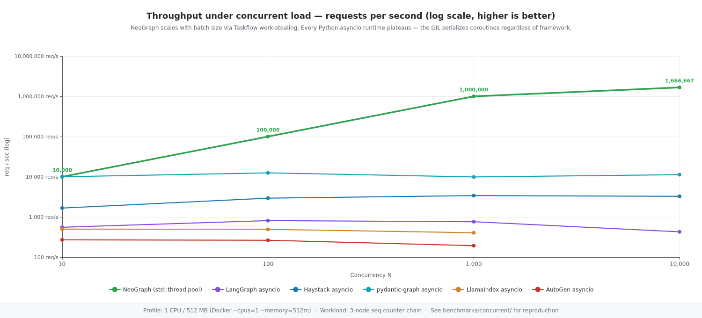
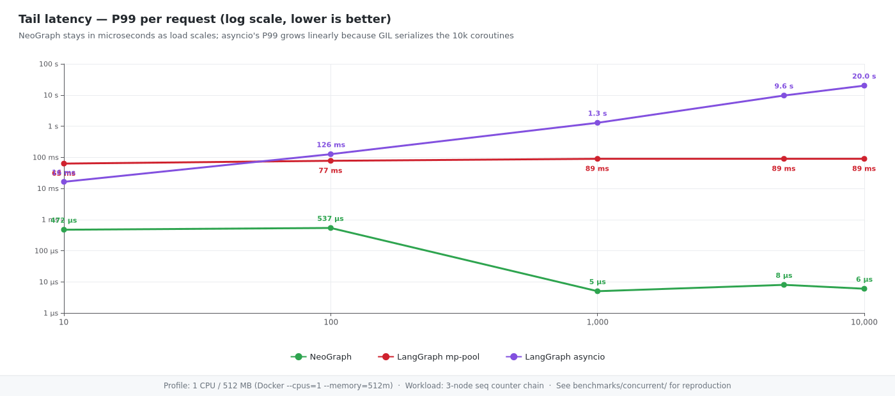
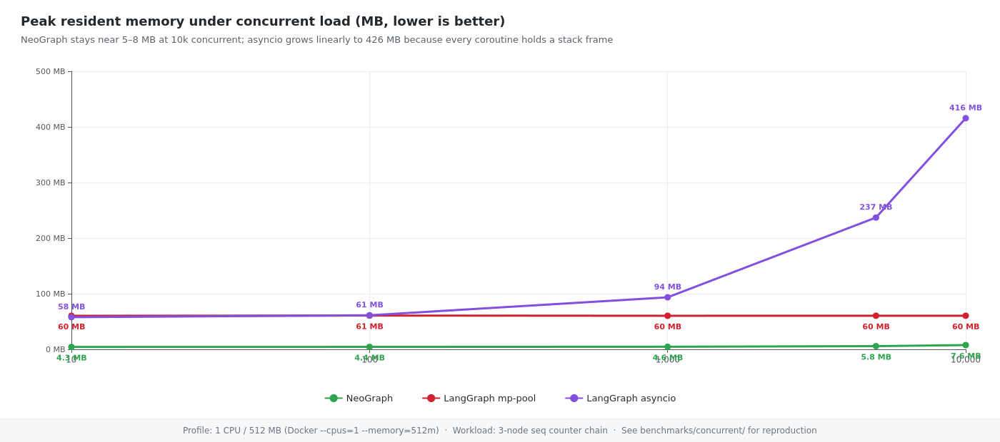

<!-- neograph-i18n: source=benchmarks/concurrent/CONCURRENT.md locale=ja source_sha256=d1bb14dd5c317c6fc2c6785110f99b2a224b80909a7875d413374ec3bb854f27 -->
# 同時負荷ベンチマーク: NeoGraphとPythonの過去の結果

**Languages:** [English](CONCURRENT.md) | [한국어](CONCURRENT.ko.md) | [日本語](CONCURRENT.ja.md) | [简体中文](CONCURRENT.zh-CN.md)

2026年4月のカウンターチェーン比較を保存しています。現在のSchemaProvider SDKやPythonバインディングでは再実行していません。「NeoGraph 3.0」は当時の記録の表記であり、現在のパッケージ版ではありません。

## ワークロードと計測区間

3ノードがoverwriteカウンターチャネルを増やします（`a → b → c`）。モデル呼び出し、待機、ネットワークI/O、チェックポイント保存はありません。Dockerの1 CPU / 512 MBと2 CPU / 1 GBでN ∈ {10, 100, 1000, 10000}回を投入し、スワップ上限をメモリ上限に合わせます。

NeoGraphは`max(hardware_concurrency(), 1)`個の呼び出し側`asio::thread_pool`を使います。計測はワーカー内で始まり、P50/P99に呼び出し側キューの待ち時間は含まれません。`total_wall_ms`は投入から全件完了までを含みます。マイクロ秒のP99をサーバーのエンドツーエンドSLOと直接比較しないでください。

当時のPython対象はLangGraph 1.1.9、Haystack 2.27.0、pydantic-graph 1.84.1、LlamaIndex Workflow 0.14.20、AutoGen GraphFlow 0.7.5のasyncioとmultiprocessingモードでした。これらは過去の版で、現在のDocker依存解決結果ではありません。

## 過去の結果: 1 CPU / 512 MB

グラフと表はNeoGraphの2026-04-22、Pythonの2026-04-19の記録です。N=10,000の表はエンジンのみで、プロバイダー転送や推論の測定ではありません。欠測値は欠測のままです。







| N | Engine + mode | Wall | P50 | P99 | Peak RSS | OK / Err |
|---|---------------|------|-----|-----|----------|---------|
| 10,000 | NeoGraph 3.0 (historical label) | 52 ms | 4 µs | 7 µs | 5.5 MB | 10000 / 0 |
| 10,000 | LangGraph asyncio | 23.4 s | 20.2 s | 23.0 s | 416.2 MB | 10000 / 0 |
| 10,000 | LangGraph mp-pool-7 | 8.0 s | 737 µs | 88.4 ms | 60.3 MB | 10000 / 0 |
| 10,000 | Haystack asyncio | 3.1 s | 1.7 s | 2.9 s | 130.7 MB | 10000 / 0 |
| 10,000 | Haystack mp-pool-7 | 2.9 s | 167 µs | 84.7 ms | 68.1 MB | 10000 / 0 |
| 10,000 | pydantic-graph asyncio | 886 ms | 71 µs | 158 µs | 42.6 MB | 10000 / 0 |
| 10,000 | pydantic-graph mp-pool-7 | 2.8 s | 253 µs | 83.8 ms | 36.7 MB | 10000 / 0 |
| 10,000 | LlamaIndex asyncio | OOM killed | — | — | — | — |
| 10,000 | LlamaIndex mp-pool-7 | 6.6 s | — | — | 102.5 MB | 0 / 10000 |
| 10,000 | AutoGen asyncio | OOM killed | — | — | — | — |
| 10,000 | AutoGen mp-pool-7 | 46.8 s | 4.6 ms | 97.1 ms | 49.1 MB | 10000 / 0 |

全行列は[`results.jsonl`](results.jsonl)に保存されています。当時のLlamaIndexとAutoGenのasyncioセルはOOM終了に分類され、この行のLlamaIndex multiprocessing呼び出しは全件失敗しました。一般的な限界やすべての失敗原因を証明するものではありません。

## 解釈の範囲

GIL有効のCPythonはPythonバイトコードを直列化しますが、イベントループ、フレームワーク処理、プロセス直列化、ワーカー数も影響します。一つの原因、asyncio全般の上限、free-threaded Pythonの性能を証明しません。

DockerのCPU割当は`hardware_concurrency()`に見えるコア数を変えない場合があります。呼び出し側プールとホスト構成を記載してください。ピークRSSはLinuxの`/proc/self/status`を読み、非対応環境の0は測定不可です。multiprocessingのメモリは各ランナーの集計範囲も確認してください。この表から256 MB実験、ベアメタル予測、永続化比較、リモートLLMの処理能力は保証できません。

## 現在の依存関係と再現状況

Coreは`NEOGRAPH_BUILD_LLM=OFF`、`NEOGRAPH_USE_LIBCURL=OFF`でも外部`SchemaProvider::runtime`をリンクします。インストール済みSDKは`CMAKE_PREFIX_PATH`、明示的なソースは`NEOGRAPH_SCHEMAPROVIDER_SOURCE_DIR`で指定します。[ビルド案内](../../README.md)を参照してください。SDKソースにはC++20、設定生成用Python、libcurl ≥7.88、OpenSSL Cryptoが必要です。現在のSDK検証範囲はLinux/POSIXで、過去のDocker結果は他の環境を検証しません。
NeoGraph `0.13.0` recipe には alpha SDK `0.1.0`、interface revision/shared generation 4 の一致する header/library が必要です。現在の統合検証は未完了です。以前の Linux/POSIX 検証は SDK4 や新しい Docker の合格記録ではありません。

現在のNeoGraph Dockerイメージはcurl/OpenSSL開発依存を入れ、`neograph::core`にリンクする専用CMake消費側をビルドしてSDK依存を継承します。SDK取得はルートCMake方針に従い、パッケージやソースを指定しなければネット接続が必要な場合があります。任意NGネットワークモジュールを無効にしてもSDKは必要です。新Docker測定は主張しません。行列はビルド前に出力を空にするため、新しいパスを指定してください。`status=ok`はJSON抽出成功のみです。`ok`、`err`、終了状態も確認してください。

```bash
# From the repository root. Docker builds use the root SDK acquisition policy.
docker build -t ng-concurrent -f benchmarks/concurrent/Dockerfile.neograph .
docker run --rm --cpus=1 --memory=512m --memory-swap=512m ng-concurrent 10000

# Full matrix; a NEW path preserves the archived results.jsonl.
bash benchmarks/concurrent/run_matrix.sh benchmarks/concurrent/results-new.jsonl

# Render the archived default results.jsonl, not the new output.
node benchmarks/render_concurrent.js
```

以下のJSONはフィールド形式の例で、追加の測定結果ではありません。

```json
{"engine":"neograph","mode":"threadpool","concurrency":10000,
 "total_wall_ms":6,"p50_us":2,"p95_us":3,"p99_us":6,
 "ok":10000,"err":0,"peak_rss_kb":7808}
```
