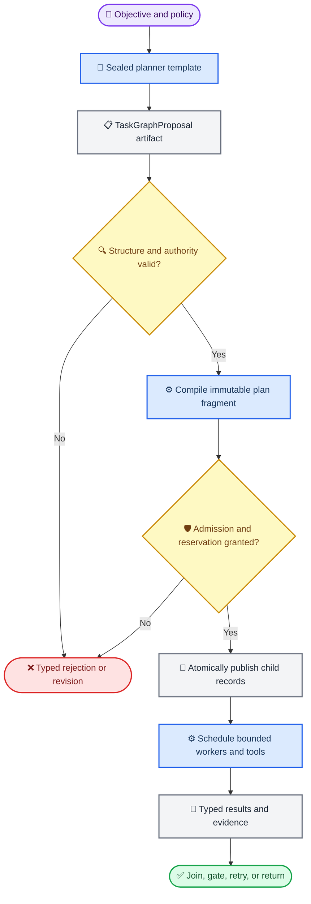

# Bounded agent synthesis through a Program DSL

_Proposal — 2026-08-06. This specifies an implementation direction; it does not change the current Core DSL, Harness wire contract, or runtime behavior._

_Implementation tracking: [#19](https://github.com/fox1245/NeoGraph-v1-redesign-backup/issues/19)._

---

## 💡 Decision

NeoGraph should support **bounded, policy-admitted agent synthesis** through the
Program layer, not by making the Core topology DSL executable control code.

A planner may propose a finite task topology, choose from pre-approved agent
and panel templates, and request work for an arbitrary number of task instances
within the run's immutable ceilings. A deterministic compiler, admission layer,
and durable scheduler turn that proposal into recorded Program work. The planner
never receives authority to create arbitrary processes, choose arbitrary tool
endpoints, inject shell commands, or bypass source validation.

> **Definition:** An _agent instance_ is a separately admitted Program child or
> sealed Core invocation created from an immutable template version. It is not a
> free-form model prompt with ambient tools or credentials.

This is the implementation path for the task-specific Harness vision in
[issue #9](https://github.com/fox1245/NeoGraph-v1-redesign-backup/issues/9). It
extends, rather than replaces, the bounded recursive-child authority work in
[issue #12](https://github.com/fox1245/NeoGraph-v1-redesign-backup/issues/12).

## 🔍 Current boundary

The working tree already has two deliberately separate layers:

| Surface | What it does now | Why it must stay separate |
| --- | --- | --- |
| Core topology DSL | Expands `vars`, non-recursive templates, and `when` into strict, static Core JSON | Its total, non-Turing-complete elaboration makes source maps and static validation tractable |
| Core graph | Executes registered nodes, including reviewed dynamic `Send`, `Command`, and interrupt behavior | Runtime behavior remains reviewed executable identity rather than model-authored JSON expressions |
| Program compiler/runtime | Compiles a typed control tree around a pinned Core generation; source support exists for control operations such as `sequence`, `parallel`, `branch`, bounded loop/retry, `spawn`, `await`, and `checkpoint` | It is the only appropriate owner of Program child identity, joins, budgets, cancellation, and durability |
| Harness `mode: "dsl"` | Elaborates a Core DSL definition and wraps it in exactly one `call_core` Program root | Existing callers rely on its Core-only meaning; changing it into a control language would be a compatibility break |

The source-level evidence and exact limitations are maintained in
[Current DSL and Program composition limits](DSL_COMPOSITION_LIMITS.md).
In particular, the currently published Program JSON Schema does not yet expose
the compiler's recursive operation grammar, and current `spawn` is deliberately
narrow: it uses a separately admitted child binding only as the direct body of
an `await`.[^current-limits]

The proposal therefore adds a **new, versioned Program authoring path**. It does
not reinterpret `mode: "dsl"`, does not add a generic Control VM, and does not
make `GraphEngine` a second control scheduler.[^program-boundary]

## ⚙️ Target architecture



The architecture has three values with different trust levels:

| Value | Producer | Trust level | May it dispatch work? |
| --- | --- | --- | --- |
| `TaskGraphProposal` | Planner or other agent | Untrusted typed data | No |
| `CompiledTaskFragment` | Deterministic compiler | Structurally valid, but not authorized | No |
| `AdmittedTaskFragment` | Admission plus reservation transaction | Immutable, policy-bound work | Yes |

No model-generated value becomes executable merely because it parses as JSON.
The transition from proposal to admitted work must remain explicit, recorded, and
reproducible from the proposal hash, template versions, registry snapshot,
policy snapshot, and compiler version.

## 📝 Public authoring model

### New Program source mode

Expose a new adapter mode such as `mode: "program"` only after a versioned
recursive Program source schema and its conformance corpus are published. The
existing `preset`, `core`, and `dsl` modes retain their meanings.

`ProgramSource v2` should define an operation tree, declared input/output
contracts, a declared budget request, and a finite template allow-list. It must
accept only the operations the compiler and runtime jointly support. Unknown
operations, fields, source-schema versions, and source-map gaps fail before
admission.

The source remains declarative. A Program author can describe control and typed
data bindings; it cannot embed host code, a tool URL, a bearer token, a file
path, or an arbitrary provider configuration.

### Sealed agent and panel templates

Dynamic instances must originate from template identities already visible to the
admission policy. A template contains at least:

| Field | Contract |
| --- | --- |
| `template_id` and immutable version/hash | Exact identity selected by proposal, compiler, receipt, and replay |
| `kind` | `worker`, `reviewer`, `judge`, `planner`, or a host-defined role |
| executable target | Pinned Core generation or separately admitted child Program version |
| input/output contracts | Typed artifact schemas, including allowed producer selectors |
| capability/effect closure | Full transitive tool, provider, store, network, and side-effect identity set |
| runtime limits | Per-instance wall time, token/cost ceiling, retries, output size, and tool calls |
| tool catalog allow-list | Exact catalog IDs and input schemas; no model-selected endpoint or credential |
| role metadata | Optional panel role, independence group, and acceptance responsibilities |

A proposal may choose only from the source's template allow-list; admission
intersects that set with the parent's frozen authority and the host policy. A
reviewer must not inherit an unneeded deployment, write, credential, or
production-data capability merely because a sibling worker has one.

### Typed data bindings instead of expression evaluation

Program dataflow stays deliberately small. Bindings name an immutable producer
artifact, a declared field, and a target input field. They do not evaluate
JavaScript, shell, regular expressions, arbitrary JSONPath, or prompt text as
code.

```json
{
  "input_bindings": [
    {
      "from": {"task": "research-api", "artifact": "findings", "field": "/summary"},
      "to": {"task": "review-security", "field": "/candidate_summary"}
    }
  ]
}
```

The example is a proposed task-graph fragment, not accepted current Program
JSON. Every `from` value must resolve to a declared producer and every `to`
value must satisfy the target template's input contract.

## 🔄 Dynamic task and topology expansion

### Two complementary shapes

The system needs two bounded expansion mechanisms; neither is an unrestricted
runtime interpreter.

| Shape | Proposed construct | Purpose | Required bound |
| --- | --- | --- | --- |
| Independent dynamic work | `parallel_map` | Execute one sealed child template once per validated task item, with bounded in-flight work | `max_items`, `max_in_flight`, per-item budget, output cap |
| Dependent dynamic work | `expand_task_graph` | Materialize a finite, acyclic `TaskGraphProposal` into a recorded Program fragment | task count, edge count, depth, dynamic-compile count, template allow-list, total budget |

`parallel_map` is intentionally distinct from current `map`, whose observed
semantics are ordered serial execution. It must state concurrency explicitly and
prove actual overlap at the provider/tool boundary rather than merely expose a
parallel-looking JSON shape.

`expand_task_graph` is for a planner that needs to select a workflow-level
DAG: for example, research in parallel, security review after code review,
then a judge or human gate. The operation has a fixed input schema and invokes a
pure compiler; it does not evaluate a returned Program JSON object directly.

### Task graph proposal contract

A `TaskGraphProposal` is a bounded data object with this minimum shape:

```json
{
  "schema_version": 1,
  "tasks": [
    {
      "id": "research-api",
      "template": "researcher/v3",
      "input_bindings": [],
      "depends_on": [],
      "budget": {"wall_time_ms": 60000, "model_tokens": 12000}
    },
    {
      "id": "review-security",
      "template": "security-reviewer/v2",
      "input_bindings": [
        {
          "from": {"task": "research-api", "artifact": "findings", "field": "/summary"},
          "to": {"field": "/candidate_summary"}
        }
      ],
      "depends_on": ["research-api"],
      "budget": {"wall_time_ms": 30000, "model_tokens": 4000}
    }
  ],
  "join": {"kind": "all"}
}
```

The validator must reject duplicate task IDs, unknown templates, absent or
ill-typed producer outputs, cycles, undeclared dependencies, oversized output
requests, and any value outside the source/admission ceilings. A loop is never
encoded as a graph cycle: it remains a separately declared Program loop with a
hard iteration limit.

At publication, the candidate must also fit the remaining
`max_program_operations`, `max_dynamic_compiles`, `max_child_depth`,
`max_total_children`, and `max_concurrency` values in the admitted
`RunBudget`, plus host-owned resource ceilings.

The canonicalizer assigns stable operation IDs from the parent run, expansion
operation ID, proposal hash, and task ordinal. Replaying a recorded expansion
must reconstruct the same child identities and never generate new work because
an LLM happened to produce different wording on resume.

### Panels are template composition

A dynamic panel is a task graph whose members share a typed objective and whose
roles come from a sealed `PanelTemplate`. `panel` may be syntax sugar only if it
lowers losslessly to `parallel_map` or `expand_task_graph`.

| Panel policy | Example behavior | Required explicit decision |
| --- | --- | --- |
| Independent review | Three role-separated reviewers inspect the same artifact | Whether reviewers may see each other's artifacts |
| Research fan-out | N researchers receive distinct typed subquestions | Task partitioner, N ceiling, and duplicate-work policy |
| Judge gate | A judge consumes bounded evidence references and produces a typed decision | Independence group, acceptance rule, and false-positive cost |
| Debate/refinement | Reviewer and fixer repeat under a bounded retry/loop | Max turns, terminal cause, and escalation path |

A panel may have any user-visible cardinality only within the immutable run,
host, and ancestor caps. “Arbitrary number of agents” therefore means that the
caller need not hard-code a small fixed N; it never means unbounded recursion,
unlimited concurrency, or automatic privilege expansion.

## 🛡️ Tool, authority, and effect boundary

Real tool use belongs inside the agent template's reviewed executable target.
The planner can request a task that uses `repo.read` or `search`, but it cannot
manufacture an HTTP endpoint, elevate a file scope, attach a credential, or
change a tool's declared effect.

For every child, effective authority is the intersection of:

```text
parent remaining authority
∩ parent spawn/expansion grant
∩ source template allow-list
∩ template capability and effect closure
∩ requested task budget
∩ owner, tenant, host, and admission policy
```

The result is monotonic down the descendant tree. Tools execute through the
host-backed catalog/executor, validate arguments against their input schema,
and record effect intent, dispatch, outcome, and idempotency identity in the
journal. Tool results are typed artifacts, not authority grants.

| Rejected input | Reason |
| --- | --- |
| A planner-provided shell command, URL, credential, or MCP endpoint | It would turn data generation into ambient authority |
| A template not in the source allow-list | The planner cannot create a new executable identity |
| A child request exceeding remaining budget, depth, total-child, or concurrency limits | Dynamic cardinality must remain finite before publication |
| A task that adds a capability/effect unavailable to its parent | Descendants cannot launder authority |
| A raw result that claims a gate passed | Worker self-report is evidence, not acceptance |

## 💾 Runtime, recovery, and scheduling

### Publication transaction

Before any worker starts, `expand_task_graph` performs a single durable
publication protocol:

1. Validate the proposal against the source schema, template registry, task
   contracts, topology limits, and source-map rules.
2. Canonicalize the proposal and compile a typed fragment with stable child IDs.
3. Calculate the transitive capability/effect closure and attenuated child
   budgets.
4. Atomically reserve root/parent capacity and persist the fragment, receipts,
   lineage, task bindings, and intended join policy.
5. Schedule only the durable published records.

A crash before step 4 leaves no runnable child. A crash after step 4 resumes or
reconciles the same records. It must never compile a fresh model answer and
silently create duplicates.

### Lifecycle rules

| Concern | Required contract |
| --- | --- |
| Concurrency | Scheduler enforces both Program `max_concurrency` and host/provider/tool ceilings; graph-level fan-out alone is insufficient evidence of real worker overlap |
| Failure isolation | Each task has a durable terminal result; join policy chooses all-of, quorum, first-valid, retry, alternate template, escalation, or cancellation |
| Cancellation | Parent cancellation propagates to active children and pending tool calls; late results remain auditable but cannot revive a terminal parent |
| Backpressure | Child artifacts/evidence are stored by reference with schema and size ceilings; complete transcripts are never injected wholesale into parent context |
| Retry | A retry has a bounded count, a stable attempt identity, and a documented budget debit; it cannot mint a fresh child quota |
| Resume/replay | Resume rebuilds identities, reservations, handles, joins, and pending effects from durable records; replay consumes recorded external results rather than re-dispatching them |
| Fairness | Host admission owns global queues and reservation ceilings so one expanding tree cannot starve unrelated Program roots |

`GraphEngine` remains the only executor of Core/application nodes. ProgramRuntime
owns only Program operation readiness, child lifecycle, joins, budget trees, and
cross-Core orchestration.[^program-boundary]

## 📊 Expected benefit and hard limits

The goal is not to make a model intrinsically smarter. The architecture changes
how a bounded model is used and how its failures are contained.

| LLM limitation | Mechanism that can reduce it | What remains unsolved |
| --- | --- | --- |
| Context loss and forgotten constraints | Local task contracts, typed artifacts, durable state, and source-pinned requirements | A task can still receive an incomplete or wrong contract |
| One-model blind spots | Role-separated workers, independent reviewers, and typed acceptance gates | Correlated models, prompts, or evidence can still agree on a false result |
| Weak decomposition | Planner proposals are structurally checked, bounded, and reviewable before dispatch | The validated plan can still pursue a bad premise or omit a necessary task |
| Unsafe or invented tool use | Sealed tool catalog, capability intersection, effect journal, and host enforcement | A permitted tool can still return stale, malicious, or incorrect data |
| Long-running continuity | Immutable plan/version identity, checkpoints, lineage, reservations, and replay | Durable state does not establish factual correctness |
| Unbounded fan-out/cost | Item, depth, budget, and host ceilings before publication | A finite but poorly chosen fan-out can still waste resources |

Success must be measured against a same-model, single-agent baseline on at least
constraint omission, invalid-result escape rate, recovery rate, duplicate work,
accepted-tool/effect violations, total cost, latency, and human intervention.
A framework that only produces more agents without improving one of those
outcomes is orchestration overhead, not a solution to an LLM limitation.

## 🏁 Delivery sequence and acceptance gates

### Delivery order

| Phase | Scope | Exit evidence |
| --- | --- | --- |
| P0 — contract | Publish Program source v2 grammar, source-map rules, template/TaskGraphProposal schemas, and negative corpus | Schema/diagnostics agree with compiler capability; existing `dsl` behavior is unchanged |
| P1 — static Program authoring | Expose explicit `mode: "program"` for already-supported static control trees | Adapter, compiler, admission, and schema conformance test the same vocabulary |
| P2 — sealed templates and `parallel_map` | Register immutable templates; add bounded independent dynamic fan-out with typed bindings | Actual provider/tool overlap is measured, ceilings are enforced, and serial `map` remains explicitly serial |
| P3 — `expand_task_graph` | Validate and compile a finite dynamic task DAG into a durable plan fragment | Cycle, type, authority, budget, and idempotent-publication fault tests pass |
| P4 — durable hierarchy | Extend child handles, scoped cancellation, joins, recovery, and recursive grants under explicit authority levels | Restart, cancellation, quota, reservation, and duplicate-dispatch tests pass |
| P5 — evaluation and rollout | Run constrained coding/research workloads with protected profiles and a single-agent control | Measured benefit, cost, and failure modes are published before broader authority defaults change |

### Non-negotiable acceptance gates

- [ ] Existing Core DSL and Harness `mode: "dsl"` retain their current
  elaboration-to-one-`call_core` behavior.
- [ ] The published Program schema, adapter, compiler, and runtime expose the
  same operation vocabulary; unsupported operation names fail deterministically.
- [ ] Every dynamic task graph is finite, acyclic except for explicit bounded
  loops, canonicalized, source-mapped, and compiled before dispatch.
- [ ] No proposal can select an unregistered agent template, tool endpoint,
  credential, capability, effect, path, provider, or model configuration.
- [ ] Child authority, depth, task count, dynamic compile count, concurrency,
  output volume, and every budget component are monotonic and jointly enforced.
- [ ] `parallel_map` proves real concurrent worker/tool execution under the host
  ceilings; `map` and `quorum` retain accurately tested/documented semantics.
- [ ] Durable publication, resume, retry, cancellation, late results, and replay
  neither lose nor duplicate child work or non-idempotent external effects.
- [ ] A required acceptance gate cannot be satisfied by the producing worker's
  self-report alone.
- [ ] The evaluation compares against the same-model single-agent baseline and
  reports negative results, cost, latency, correlated-validator failures, and
  residual failure modes.

## ⚠️ Non-goals and design constraints

This proposal intentionally does not introduce:

- an unrestricted, Turing-complete control DSL;
- planner-authored shell, HTTP, MCP, provider, credential, or filesystem access;
- arbitrary code execution embedded in a task graph;
- a second Core node executor, bytecode VM, or protocol-specific runtime;
- invisible prompt/transcript state as the authority for workflow completion;
- unbounded recursive agents, detached work by default, or host-capacity bypass;
- a claim that multiple agents establish truth, safety, or semantic correctness.

The narrowness is a feature. It keeps dynamic task count, task topology, tool
use, panels, and durable child orchestration expressive enough for real agent
systems while preserving reviewable authority, finite cost, deterministic
recovery, and a clear fault boundary.

[^current-limits]: [Current DSL and Program composition limits](DSL_COMPOSITION_LIMITS.md#what-each-surface-can-express-today), especially `H-DSL-001`, `P-SCHEMA-003`, `P-DATA-003`, `P-RUNTIME-004`, and `P-CHILD-005`.
[^program-boundary]: [NeoGraph v1 Core + Program Architecture](V1_ARCHITECTURE.md#program-semantic-model), especially the small execution vocabulary, scheduling-domain boundary, boundedness, and authority contracts.
