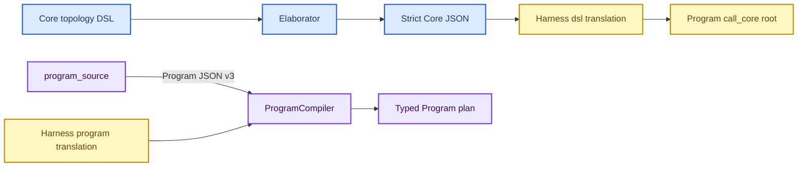

# Current DSL and Program composition limits

_Status: implementation inventory after the P2 bounded Program child-map surface — 2026-08-07. This is an implementation snapshot, not a product commitment or a replacement for [the v1 architecture](V1_ARCHITECTURE.md)._

---

## Scope and reading order

This record separates four often-conflated surfaces:

1. the bounded `graph::Elaborator` convenience language;
2. strict Core topology JSON and registered Core node behavior;
3. the typed Program operation tree; and
4. Harness `mode: "dsl"` and `mode: "program"`, which deliberately admit different source languages.

Code is the source of truth for this snapshot. The superseded [Programmable
Harness DSL study](PROGRAMMABLE_HARNESS_DSL_DESIGN.md) is useful history but
must not be used to infer current runtime behavior.

## Boundary at a glance

The important boundary is directional: Core DSL can produce strict Core JSON,
but it does not produce a Program operation tree. Harness preserves that
boundary by keeping `mode: "dsl"` on the one-`call_core` path and admitting
Program composition only through the separate `mode: "program"` path.

## What each surface can express today

| Surface | Accepted constructs | Explicit boundary |
| --- | --- | --- |
| Core topology DSL | `vars`, whole-value and scalar interpolation, non-recursive `templates` + `use`, local node-prefix renaming, global channel merge, and boolean `when` | Elaboration removes all DSL keys and returns strict Core topology JSON; it never emits Program operations. [Elaborator contract](../include/neograph/graph/elaborator.h#L5-L87) |
| Strict Core JSON | Static channels, nodes, edges, conditional edges, barriers, static interrupts, retry policy, and registered node configuration | Topology is data. Runtime-determined routing and pauses come from registered node code, not a JSON expression evaluator. [Topology model](../include/neograph/graph/compiler.h#L73-L93) |
| Program JSON (compiler) | `call_core`, `sequence`, `branch`, bounded `loop`/`retry`, `parallel`, `race`, `quorum`, `map`, bounded `parallel_map`, `spawn`, `await`, `emit`, `checkpoint`, `cancel`, and `return` | Program-v1 preserves the one-`call_core` legacy contract; Program-v2 publishes the recursive operation grammar; Program-v3 adds the typed bounded child map. Compiler and admission checks remain authoritative for semantic closure. [Operation list](../src/program/compiler.cpp#L360-L452) |
| Harness `mode: "dsl"` | Bounded Core DSL plus sealed Harness worker enrichment | It elaborates to Core and constructs a Program document with one `call_core` root; it does not accept a Program tree from the request. [Translation path](../src/mcp/harness_program_translator.cpp#L870-L915) |
| Harness `mode: "program"` | Program-v2 static operations over the sealed Harness Core definition | It preflights through `ProgramCompiler`, derives exact finite budgets, and rejects durable child publication and child scheduling (`spawn`, `parallel_map`), transport values, or unsupported authority. [Translation path](../src/mcp/harness_program_translator.cpp#L915-L1045) |

## Verified practical limits

### H-DSL-001: Harness separates Core DSL from Program composition

`HarnessRequestTranslator::translate()` sends `harness.definition` through
`Elaborator` only for `mode == "dsl"` and emits a Program document whose root is
exactly `{"op":"call_core", ...}`. `mode == "program"` instead requires a
Program root with an embedded strict Core definition, compiles it before
translation, and maps compiler diagnostics back to the authored request.[^harness-modes]

**Effect:** Existing `dsl` callers retain the total elaboration-to-Core
contract. A Harness `program` caller can author the admitted v2 static
vocabulary: `call_core`, `sequence`, `branch`, bounded `loop`/`retry`,
`parallel`, binary `race`, `quorum`, serial `map`, `await`, `emit`,
`checkpoint`, `cancel`, and `return`. A direct Program compiler caller
using schema v3 can additionally author bounded `parallel_map`.

**Boundary:** Harness Program mode does not admit durable child publication or
scheduling: `spawn` and `parallel_map` are rejected even though the direct
Program compiler represents them. It also does not reinterpret `dsl` as
Program JSON.

### P-CORE-002: One Program document seals one directly callable Core graph

The Program root must contain one embedded strict Core `definition` whose name
matches the root name. Every nested `call_core` is lowered to that same root
name; a different `core` reference is rejected.[^program-single-core]

**Effect:** A Program can repeat or place control around one pinned Core graph,
but cannot directly compose Core graph `A` followed by Core graph `B` in one
source document. Separately admitted child Programs are the available boundary
for a distinct graph today.

### P-SCHEMA-003: Versioned Program schema publishes the operation grammar

`program-document-v1.schema.json` remains the legacy one-`call_core` contract.
`program-document-v2.schema.json` publishes the recursive typed operation
grammar. `program-document-v3.schema.json` adds `parallel_map` and keeps the
v2 vocabulary unchanged; the source declares the matching version and
`ProgramCompiler` enforces the version-specific surface.[^program-schema]

**Effect:** Schema-driven callers can author static Program composition through
the explicit v2 or v3 contract. A v1 caller keeps its original strict boundary.

**Boundary:** JSON Schema validates portable source shape. `ProgramCompiler`
still enforces registry closure, one sealed Core identity, exact finite budgets,
operation semantics, child binding closure, and source-coordinate diagnostics
before a Program can be admitted. Harness Program mode intentionally remains a
v2 profile.

### P-DATA-003: Program dataflow is intentionally small

Program conditions support JSON-pointer equality, inequality, existence, and
`all`/`any`/`not` composition. There are no numeric comparisons, regexes,
user-defined predicates, Program-level variables, interpolation, or expression
evaluation.[^program-condition]

`emit` and `return` carry authored JSON values; they do not evaluate a template
against the current state.[^program-literal-values] `map` passes each literal
item as the body state, but does not introduce a named binding or result
projection language.[^program-map]

`parallel_map` is the deliberately narrower child-work dataflow: its item
source is either a bounded literal array or one JSON Pointer into the current
Program state; input and output bindings are JSON Pointers only. The runtime
does not evaluate expressions, run an authored body, or allow a caller to
choose an arbitrary child Program. The child binding, finite item/concurrency
limits, output-byte cap, and failure policy are all explicit typed fields.

**Effect:** Any nontrivial routing predicate or output construction remains a
registered Core node responsibility. That keeps Program admission finite and
inspectable, but makes some ordinary orchestration shapes verbose or
unexpressible without a purpose-built node.

### P-RUNTIME-004: Operation names carry constrained semantics

| Operation | Observed behavior | Consequence |
| --- | --- | --- |
| `race` | The compiler rejects every arity other than two with `P_PLAN_RACE_ARITY`; the runtime implements a deterministic binary race | Three-way races receive a stable grammar diagnostic during compilation. N-ary race remains unsupported. [Compiler](../src/program/compiler.cpp#L680-L702), [runtime](../src/program/run_attempt.cpp#L931-L936) |
| `quorum` | Branches execute in declaration order until enough succeed or success becomes impossible | It is not concurrent fan-out and cannot cancel already-running siblings because it launches none concurrently. [Runtime](../src/program/run_attempt.cpp#L1055-L1080) |
| `map` | Items execute in declaration order | It is ordered serial mapping, not bounded parallel mapping. [Runtime](../src/program/run_attempt.cpp#L1083-L1103) |
| `parallel` | All branches launch concurrently, subject to run-wide `max_concurrency` checks | Parallelism is real but is capped by the admitted budget and nested Core dispatches share that cap. [Runtime](../src/program/run_attempt.cpp#L833-L928) |
| `parallel_map` | Validated items launch through one admitted child binding with at most `max_in_flight` active children; outputs are assembled in item order | It is real bounded child fan-out, not a parallel-looking JSON shape. `fail_fast` stops new launches and cancels active children; `collect` waits for all launched children and reports the first failure. [Runtime](../src/program/run_attempt.cpp#L1183-L1476) |

### P2-MAP-005: Bounded parallel child work

`parallel_map` is available only in direct Program schema v3. It accepts:

- `item_source: {"literal": [...]}` or `{"artifact":"input","field":"<JSON Pointer>"}`;
- `input_binding.from` and `input_binding.to` JSON Pointer endpoints;
- `output_binding.from` as the child-output JSON Pointer;
- an exact admitted `child_binding`;
- positive `max_items`, `max_in_flight`, and `max_output_bytes` bounds, with
  `max_in_flight <= max_items`; and
- `failure_policy: "fail_fast"` or `"collect"`.

The compiler rejects ambiguous sources, malformed pointers, literal arrays
larger than `max_items`, unsupported schema versions, and child-budget floors
that cannot cover the finite map. Static derivation charges one parent
operation, `max_in_flight` concurrency, `max_items` total children, and child
depth one. Each launched child is still separately admitted, journaled, and
attached to the parent; the map adds no inline child code or arbitrary handle
lookup.

**Failure semantics:** `fail_fast` records the first failed item, prevents
further launches, and cancels active children. `collect` lets all permitted
items finish, preserves successful mapped outputs in item order, and then
returns the first failure if any. Output serialization is checked against
`max_output_bytes` before the map result is returned.

### P-CHILD-005: Child control is durable but deliberately narrow

`spawn` accepts a separately admitted `child_binding` and explicitly rejects an
inline body. The compiler also requires it to be the direct body of `await`, so
a Program cannot retain or pass a named child handle.[^program-spawn] The runtime
then calls `launch_child()` and returns the child run/version identifiers to that
`await`. `await` accepts an inline `body` plus an optional timeout; it recognizes
a spawned child body, but has no public handle ID or event-selector form.[^program-await]
`cancel` currently admits only the whole-run scope.[^program-cancel]

**Effect:** This is not a general remote-procedure or dynamic-agent language.
Child identity, authority, and budget remain explicit, but callers cannot
selectively cancel a branch/child or await an arbitrary named event through the
current Program JSON grammar.

### C-CORE-006: Dynamic topology behavior is node implementation behavior

A Core node may return `Send` with a runtime-selected target and input, return
`Command` to override the next node and update channels, or throw
`NodeInterrupt` to request a checkpointed pause.[^core-send-command][^core-interrupt]

**Effect:** The static Core DSL can declare all static graph shapes, but cannot
encode arbitrary data-dependent `Send`, `Command`, or dynamic interrupt logic.
Those behaviors require a registered node type whose implementation is reviewed
and admitted with the appropriate capability/effect closure. This is a
security-preserving boundary, not a missing interpolation feature.

### S-SUBGRAPH-007: File-backed Core subgraphs require profile-specific review

The default Core `subgraph` node supports either an inline inner topology or a
string file path, which it opens with `std::ifstream` before compiling the inner
graph.[^subgraph-file] Harness's generic transport-field rejection blocks keys
such as `url`, `command`, and credentials, but it does not reject a `definition`
string or a file path.[^harness-transport]

**Effect:** This is conditional on the host exposing a `subgraph` node manifest:
current Harness snapshots only expose configured node manifests. If an untrusted
Harness profile exposes the Core `subgraph` node, it needs an explicit path
policy or an inline-only wrapper. Do not treat Core subgraph file loading as a
Program child-program feature; it does not carry Program child identity,
admission, or lifecycle semantics.

### P-DURABILITY-008: Child join repair remains an explicit recovery boundary

The child completion callback attempts the parent join update through the existing
transition-store CAS path. It retries that path a bounded five times; if every
attempt conflicts or the store is unavailable, the child terminal journal remains
the source of truth but the parent's child record may remain `Publishing` or
`Dispatched`. The callback does not claim that the parent join was durably
published. `recover_children(owner_scope, parent_run_id)` is the explicit repair
operation and must be run after the store becomes available.

Parent cancellation propagates to live `RunControl` children. A process restart
retains the durable child admission and terminal records, not live child handles;
restart recovery therefore requires the same explicit `recover_children` sweep.
Non-idempotent pending effects remain `AmbiguousEffect` until an operator supplies
`reconcile`; no automatic retry is implied.

This is a P3/P4 durability boundary, not a P2 `parallel_map` semantic guarantee.
Adding an automatic durable completion outbox, run enumeration, or selective
post-restart cancellation requires a separate storage and lifecycle contract.[^program-child-durability]

## Classification and next decisions

| ID | Classification | Why it matters | Minimum safe next action |
| H-DSL-001 | Closed boundary | Program composition is reachable only through a distinct Harness mode, preserving `dsl` semantics; Harness Program mode remains v2-only | Keep `dsl` and Harness `program` source admission separate; expand direct Program operations only with matching compiler and runtime proof |
| P-CORE-002 | Product gap | One Program cannot directly compose independently pinned Core graphs | Decide whether multi-Core modules are needed before extending `call_core` references |
| P-SCHEMA-003 | Closed v3 public contract | Program-v3 publishes the recursive static operation source plus bounded `parallel_map`; v1 and v2 remain versioned | Maintain v1/v2/v3 conformance fixtures and version-specific admission limits |
| P-DATA-003 | Deliberate restriction with usability cost | Prevents ambient computation in Program JSON; `parallel_map` adds only pointer bindings | Add only typed, bounded data transforms justified by a concrete workload; keep arbitrary predicates in registered nodes |
| P-RUNTIME-004 | Deliberate operation semantics | `map`/`quorum` remain serial; `parallel_map` is bounded child fan-out with explicit failure policy | Keep binary race validation and require overlap, cap, cancellation, and output-bound regression coverage |
| P-CHILD-005 | Deliberate authority boundary with missing controls | Child admission is safe, but control operations are narrow; `parallel_map` has no arbitrary child handle lookup | Add scoped cancellation and explicit handle/event await only with durable lineage and recovery semantics |
| C-CORE-006 | Deliberate Core boundary | Keeps dynamic control in reviewed executable identities | Preserve this boundary; do not add raw code or arbitrary callbacks to DSL input |
| S-SUBGRAPH-007 | Conditional security risk | A host that exposes the default file-backed node may admit caller-selected local paths | Add an untrusted-profile rejection test before exposing that manifest |
| P-DURABILITY-008 | Explicit P3/P4 recovery boundary | Child terminal truth is durable, but a bounded parent-join CAS failure can leave the parent relation in flight; restart has no live child handles | Run `recover_children` after store recovery; design an outbox/run-enumeration contract before claiming automatic repair |

## Required regression cases before expanding the surface

| Scenario | Observable contract |
| Harness `dsl` containing a Program operation | Fails with a source-level diagnostic; explicit `program` mode accepts the admitted static operation grammar without changing `dsl` meaning |
| Published Program JSON Schema for `sequence` and `parallel_map` | Program-v1 rejects both; Program-v2 accepts `sequence`; Program-v3 accepts `sequence` and bounded `parallel_map` alongside compiler/admission validation |
| Three-branch `race` | Fails during compilation with `P_PLAN_RACE_ARITY` until n-ary behavior is implemented |
| `map` and `quorum` | Tests state whether execution is serial or concurrent and enforce that documented choice |
| `parallel_map` item/binding limits | Literal and input-pointer sources, JSON-pointer input/output bindings, max-items, max-in-flight, and output-byte limits fail closed with source diagnostics |
| `parallel_map` failure policies | `fail_fast` stops launching and cancels active children; `collect` waits for all launched children and returns the first failure with an item witness |
| Multiple Core graph references | A Program either rejects a second Core identity during compilation or resolves a sealed, admitted module reference with an exact source map |
| Child cancellation and await | A child/branch scope cannot be silently accepted as run scope; future support must persist and recover the exact target handle |
| Untrusted subgraph definition string | The relevant admission profile rejects file-backed definitions or resolves only an approved virtual source |

## Evidence

[^harness-modes]: [`src/mcp/harness_program_translator.cpp`](../src/mcp/harness_program_translator.cpp), [`tests/test_harness_program_translator.cpp`](../tests/test_harness_program_translator.cpp#L275-L478)
[^program-schema]: [`schemas/program-document-v1.schema.json`](../schemas/program-document-v1.schema.json), [`schemas/program-document-v2.schema.json`](../schemas/program-document-v2.schema.json), [`schemas/program-document-v3.schema.json`](../schemas/program-document-v3.schema.json), [`include/neograph/program/schema.h`](../include/neograph/program/schema.h)
[^program-single-core]: [`src/program/compiler.cpp`](../src/program/compiler.cpp#L360-L452), [`src/program/compiler.cpp`](../src/program/compiler.cpp#L587-L600)
[^program-condition]: [`src/program/compiler.cpp`](../src/program/compiler.cpp#L455-L512)
[^program-literal-values]: [`src/program/compiler.cpp`](../src/program/compiler.cpp#L798-L806), [`src/program/run_attempt.cpp`](../src/program/run_attempt.cpp#L1249-L1261)
[^program-map]: [`src/program/compiler.cpp`](../src/program/compiler.cpp#L727-L743), [`src/program/run_attempt.cpp`](../src/program/run_attempt.cpp#L1083-L1103)
[^program-parallel-map]: [`src/program/compiler.cpp`](../src/program/compiler.cpp#L780-L985), [`src/program/plan.cpp`](../src/program/plan.cpp#L176-L243), [`src/program/run_attempt.cpp`](../src/program/run_attempt.cpp#L1183-L1476), [`tests/test_program_runtime.cpp`](../tests/test_program_runtime.cpp#L3619-L3770)
[^program-spawn]: [`src/program/compiler.cpp`](../src/program/compiler.cpp#L744-L761), [`src/program/compiler.cpp`](../src/program/compiler.cpp#L817-L857), [`src/program/run_attempt.cpp`](../src/program/run_attempt.cpp#L1106-L1125)
[^program-await]: [`src/program/compiler.cpp`](../src/program/compiler.cpp#L762-L769), [`src/program/run_attempt.cpp`](../src/program/run_attempt.cpp#L1142-L1221)
[^program-cancel]: [`src/program/compiler.cpp`](../src/program/compiler.cpp#L779-L797)
[^core-send-command]: [`include/neograph/graph/types.h`](../include/neograph/graph/types.h#L247-L292)
[^core-interrupt]: [`include/neograph/graph/types.h`](../include/neograph/graph/types.h#L138-L200)
[^subgraph-file]: [`src/core/graph_loader.cpp`](../src/core/graph_loader.cpp#L245-L290)
[^harness-transport]: [`src/mcp/harness_program_translator.cpp`](../src/mcp/harness_program_translator.cpp#L485-L502), [`src/mcp/harness_program_translator.cpp`](../src/mcp/harness_program_translator.cpp#L937-L972)
[^program-child-durability]: [`src/program/runtime.cpp`](../src/program/runtime.cpp#L749-L905) persists child admission and completion through the parent transition journal; [`src/program/runtime.cpp`](../src/program/runtime.cpp#L2921-L2980) is the explicit recovery sweep.
