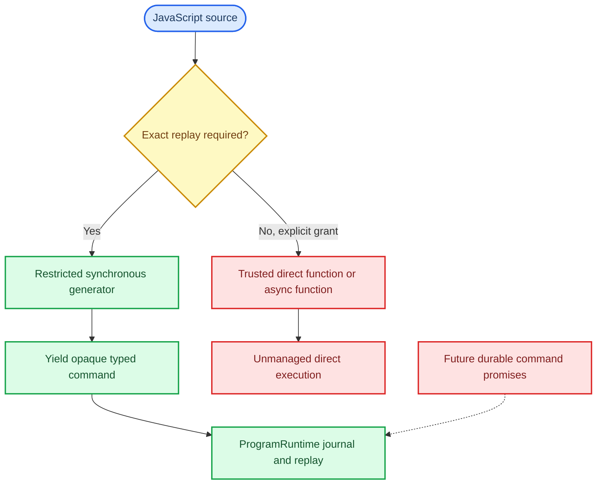

# QuickJS Execution Profiles and Extension Boundary

Status: Accepted architecture decision; `restricted_durable` is the current
baseline, while `trusted_direct` and durable Promise execution remain planned  
Date: 2026-08-10  
Parent architecture: [QuickJS Control Architecture](QUICKJS_CONTROL_ARCHITECTURE.md)  
Public boundary: [QuickJS Public Authoring Boundary](QUICKJS_PUBLIC_AUTHORING_BOUNDARY.md)  
Authority and guarantee model: [Self-Evolving Agent Controller](SELF_EVOLVING_AGENT_CONTROLLER.md)  
Executable contracts: owner-local runtime and controller contracts
Tracking: [#35](https://github.com/fox1245/NeoGraph-v1-redesign-backup/issues/35)

## Decision

NeoGraph has one user-authored programming language: standard JavaScript on
embedded QuickJS. JavaScript is sufficient for open-ended computation—functions,
closures, recursion, loops, exceptions, modules, parsers, and application-level
control abstractions. NeoGraph will not add `ng.if`, `ng.loop`, `ng.map`, a
second expression grammar, or a replacement control-flow DSL.

Turing completeness is a language property, not an admission promise. Every
NeoGraph run remains finite because the host enforces nonrenewable instruction,
memory, stack, wall-time, child, effect, concurrency, token, and monetary
budgets. A source loop is allowed; an infinite or over-budget loop is interrupted
before it can turn an exhausted resource grant into an unbounded run.

The runtime must distinguish JavaScript freedom from the stronger guarantees that
only NeoGraph can provide. There are therefore two explicit execution profiles
and one deliberately deferred design:

| Profile or design | Entry shape | Host authority | Recovery and guarantee |
|---|---|---|---|
| `restricted_durable` | Synchronous generator `main(input)` | Only sealed, admitted typed commands and pure intrinsics | The generator yield is the durable boundary. Exact replay, cancellation, and journal/outbox semantics apply according to the admitted effect closure. |
| `trusted_direct` | Ordinary synchronous or `async main(input)` | Explicit developer-authorized native, capability, or direct-host bindings | Always `unmanaged` for the direct execution. It can be bounded, cancelled, and reported, but it cannot claim cross-process exact replay, duplicate prevention, or crash resume. |
| `durable_async` | Future `async main(input)` with durable command promises | Only after a new scheduler and recovery contract exists | Not implemented and not implied by either JavaScript Promises or `trusted_direct`. It may claim `strict` only after its dedicated evidence gate passes. |

`define()` remains synchronous, bounded, and dispatch-free in every profile. It
may use ordinary JavaScript computation to construct a static topology, but it
never receives a direct-effect escape hatch. The result must still be one
validated, canonical strict Core artifact.



## Restricted durable execution

The existing synchronous-generator ABI remains the only default durable control
path:

```javascript
export function* main(input) {
  let draft = input.draft;

  for (let attempt = 0; attempt < 5; ++attempt) {
    const review = yield ng.callCore("reviewer", {draft, attempt});
    if (review.accepted) return {draft, attempt};
    draft = yield ng.callCore("reviser", {draft, feedback: review.feedback});
  }

  throw new Error("review attempts exhausted");
}
```

A generated command is an opaque host-created value. At the yield boundary,
`ProgramRuntime` validates its registered schema, import slot, capability,
budget, ownership, source site, and replay coordinate; journals it before
dispatch; records its terminal outcome; and resumes the generator with that
canonical outcome. Recovery replays pinned source only through recorded
outcomes, so a completed non-idempotent effect is not dispatched twice.

The current implementation intentionally rejects top-level await and requires
this generator shape. That is an execution ABI choice, not a claim that
JavaScript itself cannot express asynchronous code.

## Extension boundary

Normal JavaScript source modules are the preferred way to create helpers. A
library helper that composes existing commands needs no new parser, native
command kind, or scheduler:

```javascript
// trusted helper module; ordinary source code, not a NeoGraph DSL
ng.retryUntil = function* (input, maxAttempts) {
  for (let attempt = 0; attempt < maxAttempts; ++attempt) {
    const result = yield ng.callCore("reviewer", {input, attempt});
    if (result.accepted) return result;
  }
  throw new Error("retry exhausted");
};

export function* main(input) {
  return yield* ng.retryUntil(input, 5);
}
```

The namespace contract is profile-specific:

| Property | `restricted_durable` | `trusted_direct` |
|---|---|---|
| `ng` namespace | Non-extensible | Extensible for application helpers |
| Built-in kernel members such as `callCore` | Non-writable and non-configurable | Non-writable and non-configurable |
| Added helper properties | Rejected | Allowed under the admitted trusted profile |
| Recognized durable command | Opaque value created by a built-in command constructor | The same opaque value and registered schema; never a property-name convention |
| Ambient authority | Denied by default | Still denied unless host admission grants it |

An implementation must not make `ProgramRuntime` recognize a command because a
source property is named `ng.callCore`. Replacing, wrapping, or adding JavaScript
properties cannot forge a command or redirect a recognized durable action. The
runtime recognizes only the opaque command representation created by an admitted
binding and validated against its registered schema and receipt.

`ng.map`, `ng.retryUntil`, a domain-specific control helper, or a fluent API is
therefore ordinary JavaScript. It becomes runtime work only when it introduces
one of the following new semantic surfaces:

| Desired extension | Required integration |
|---|---|
| Pure JavaScript helper that composes commands | Source module or trusted `ng.*` helper only |
| Pure deterministic native helper | Admitted intrinsic with bounded cost, no external effect, and replay-safe behavior |
| New durable command | Registered schema, executable manifest, capability/effect declaration, journal, cancellation, replay, and diagnostics support |
| New parallel/race/quorum scheduling semantics | `ProgramRuntime` extension; JavaScript cannot privately become a second scheduler |
| Direct native, filesystem, network, process, or provider call | Explicit `trusted_direct` authority and honest weaker guarantee labeling |

The existing typed structured-concurrency commands remain valid library building
blocks. For example, `ng.map` may construct command descriptors and lower them
to the existing bounded `ng.parallel` command. It may not bypass the runtime's
admission, child lineage, `max_in_flight`, cancellation drain, or budget checks.

## Trusted direct execution

`trusted_direct` exists for an application owner who deliberately wants the
freedom of an ordinary embedded program: custom C++ APIs, application-owned
network clients, native libraries, or `async main()` ergonomics. The host, not
source text, grants this profile and its exact capabilities. Source cannot create
or broaden its own filesystem, network, credential, process, provider, tenant,
budget, or effect authority.

A trusted direct runner must still:

- bind the exact profile version, effective grants, native identities, and
  execution-guarantee floor into source, bundle, admission, and run identity;
- own all asynchronous state as canonical host data rather than borrowed
  `JSValue`, `JSContext`, or JavaScript closures;
- serialize each QuickJS context on one owning executor;
- route completion to that executor before Promise settlement or JavaScript
  continuation execution;
- apply the granted timeout, cancellation, resource, and terminal-reporting
  policy; and
- mark the entire direct execution `unmanaged`; recording an individual direct
  call cannot upgrade an ordinary Promise graph to `recorded` or `strict`
  recovery.

A process crash during a direct effect can leave its external state unknown.
NeoGraph must report that fact instead of retrying it as if it had crossed the
durable journal/outbox boundary. A `strict` parent may consume a weaker
trusted/direct descendant only when its admission contract explicitly accepts the
weaker guarantee floor.

## Why ordinary async is not durable yet

This code is allowed only in `trusted_direct` until a separate durable-async
runtime exists:

```javascript
export async function main(input) {
  const review = await app.review(input);
  return review;
}
```

Treating `ng.callCore()` as an ordinary Promise without further design would hide
the effect boundary inside a Promise graph. Dispatch timing, `Promise.all`,
`Promise.race`, `.then()`, abandoned promises, cancellation, late completion,
and microtask ordering would become recovery-relevant but unrecorded.

A future `durable_async` design must prove all of the following before it can
advertise the generator path's guarantee:

1. **Journal-before-dispatch:** every durable command receives a stable identity,
   canonical arguments, and a persisted admission record before its effect starts.
2. **One VM owner:** native completion enters a host-owned queue; only the owning
   QuickJS executor settles a Promise and pumps its microtask queue.
3. **Recorded ordering:** creation, dispatch, settlement, continuation, winner,
   cancellation, and late-completion ordering that affects recovery are recorded
   or deterministically reconstructed.
4. **Recovery:** restart rebuilds the pending command/promise state from pinned
   source and recorded outcomes without reissuing completed non-idempotent work.
5. **Structured concurrency:** `all`, `race`, quorum, child ownership, budget
   reservation, cancellation, and drain remain owned by `ProgramRuntime`, not by
   untracked Promise behavior.
6. **Failure evidence:** race, crash, cancellation, replay, thread-affinity,
   native-lifetime, and duplicate-effect tests pass under a preregistered gate.

This is a separate scheduler project, not a small relaxation of the `async`
keyword check.

## Implementation and migration rules

The delivery tracked by [#35](https://github.com/fox1245/NeoGraph-v1-redesign-backup/issues/35) must preserve the following order:

1. keep the restricted generator path and its replay behavior unchanged;
2. add versioned profile metadata, trusted namespace behavior, and guarantee
   propagation;
3. add the explicit trusted-direct runner and its owner-thread lifecycle;
4. prove that every direct run is visibly `unmanaged` unless a stronger
   registered boundary exists; and
5. consider durable Promise execution only under a new independently reviewed
   design and acceptance gate.

No profile may reintroduce the Core DSL, Program JSON DSL, a hidden fallback
compiler, an unregistered scheduler, or ambient authority. Core-only consumers
remain independent of QuickJS when Program support is disabled.

## Required evidence

Before the trusted profile is shipped, tests must demonstrate that:

- restricted hostile source cannot extend or replace the command kernel, reach
  ambient host resources, or cause forbidden dispatch;
- trusted source can add a helper and compose immutable commands without
  changing the command schema or bypassing admission;
- built-in command members remain immutable and cannot be substituted with a
  forged command;
- an explicit trusted `async main()` receives the `unmanaged` guarantee floor in
  its catalog and run diagnostics;
- a `strict` parent rejects an unacknowledged weaker descendant before dispatch;
- worker completion never invokes QuickJS directly; and
- the existing generator restart suite still reaches the exact pending command
  and repeats zero completed non-idempotent effects.
