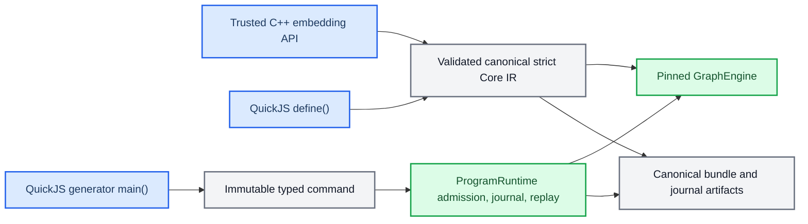
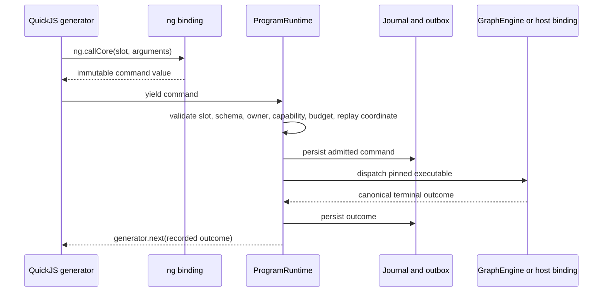
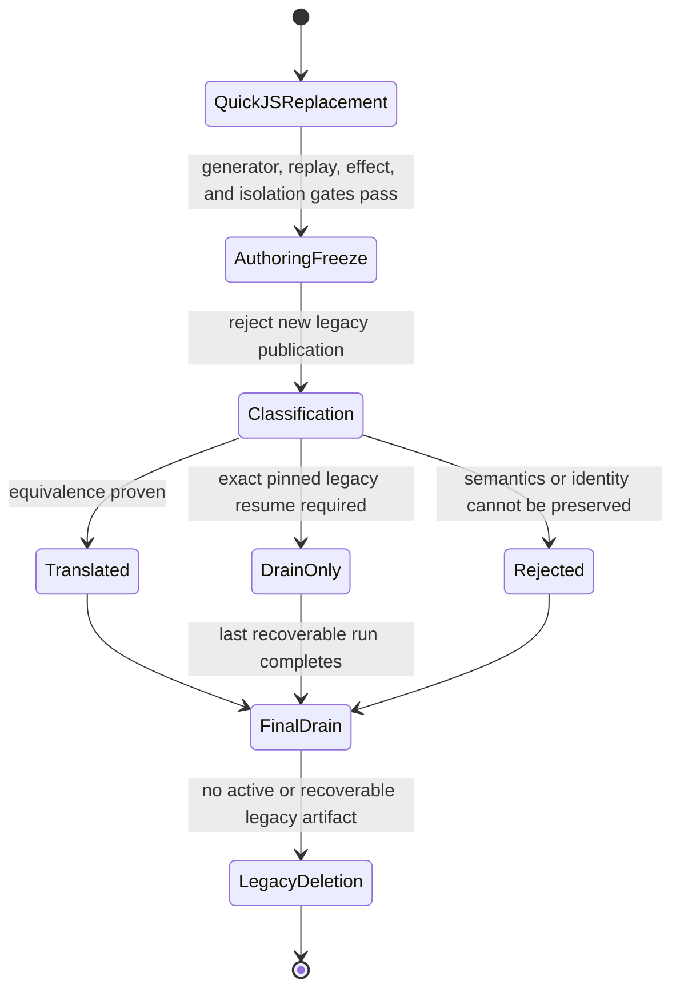

# QuickJS Public Authoring Boundary

Status: Adopted architecture contract; Core DSL/elaborator and Program JSON authoring deletion complete
Final no-deployment drain proof passes; platform/consumer qualification remains

Date: 2026-08-10
Parent architecture: [QuickJS Control Architecture](QUICKJS_CONTROL_ARCHITECTURE.md)  
Migration plan: [QuickJS Control Runtime Migration Plan](QUICKJS_CONTROL_MIGRATION.md)  
Execution profiles: [QuickJS Execution Profiles and Extension Boundary](QUICKJS_EXECUTION_PROFILES.md)
Executable contract: [`../spec/quickjs-control-runtime.sdd.yaml`](../spec/quickjs-control-runtime.sdd.yaml)  
Tracking: [#23](https://github.com/fox1245/NeoGraph-v1-redesign-backup/issues/23), [#27](https://github.com/fox1245/NeoGraph-v1-redesign-backup/issues/27), [#35](https://github.com/fox1245/NeoGraph-v1-redesign-backup/issues/35), [authoring-boundary decision](https://github.com/fox1245/NeoGraph-v1-redesign-backup/issues/27#issuecomment-5230015368)

## Decision

The target state, reached after the authoring cutover and final legacy drain,
exposes exactly two authoring frontends:

1. the direct NeoGraph C++ embedding API for trusted applications; and
2. standard JavaScript executed by embedded QuickJS through a profile-governed
   `ng` binding.

`restricted_durable` is the default JavaScript execution ABI. An explicitly
admitted `trusted_direct` profile is still JavaScript, not another source
language or a public JSON/DSL frontend.
The bounded Core DSL and elaborator and the Program JSON operation-tree authoring
surface are deleted. Retained canonical storage decoding and migration
classification do not expose either source system as a compatibility mode,
fallback parser, hidden Harness request mode, or alternate runtime.

This decision does **not** remove canonical JSON from NeoGraph. Strict Core JSON
remains an internal canonical serialization and low-level interchange artifact;
Program bundles, journals, transition records, and transport messages retain
their canonical serialized representations. Data serialization is not an
authoring language.

## Scope

### Authoring is different from data

An authoring frontend lets a caller describe control flow or graph composition
as executable source. A data artifact records a graph, bundle, command, or
outcome that NeoGraph has already validated and sealed. The distinction is a
security and durability boundary, not merely an API preference.

| Surface | After cutover | Why |
|---|---|---|
| Direct C++ graph and runtime API | Retained | Trusted embedding/application API; callers own process construction and do not submit a wire-level source language. |
| QuickJS `define()` | Retained | JavaScript graph composition lowers to validated strict Core IR without dispatch. |
| QuickJS restricted generator `main()` | Retained | JavaScript owns ordinary control flow and yields immutable durable commands. |
| QuickJS trusted/direct `main()` | Planned through [#35](https://github.com/fox1245/NeoGraph-v1-redesign-backup/issues/35) | Explicitly authorized ordinary or `async` JavaScript may use direct bindings, with an honest `unmanaged` guarantee rather than inferred durable replay. |
| Strict Core JSON | Internal/interchange only | Canonical storage, hashing, diagnostics, and low-level exchange; never selected as a Harness authoring mode. |
| Program bundle/journal/record JSON | Internal/interchange only | Immutable durable artifacts, not executable input syntax. |
| Core DSL / `graph::Elaborator` | Deleted | JavaScript replaces variables, interpolation, templates, conditional inclusion, and composition helpers. |
| Program JSON operation trees | Deleted | JavaScript generators replace sequence, branch, loop, map, retry, and general orchestration source semantics. |
| Harness `mode: "dsl"` / `mode: "program"` | Deleted | A public transport must not silently choose a legacy compiler. |

A C++ API may use `neograph::json` as an in-process value type. For example,
`GraphEngine::build_strict()` currently receives a `json` topology document.
That does not make JSON an externally accepted NeoGraph source language: a
trusted C++ process constructs a value, passes it through the normal validator,
and owns its deployment boundary. This cutover does not require an unrelated
rewrite of every C++ `json` parameter into a new builder class.

## Runtime ownership



`GraphEngine` remains the only executor of Core/application nodes. QuickJS is
not a scheduler, a checkpoint owner, an effect executor, or a substitute for
admission and journal semantics.
The diagram intentionally depicts only the restricted durable JavaScript path.
An explicitly admitted trusted/direct `main()` is outside that recovery lane;
its authority and weaker guarantee must be visible in the admitted identity and
run record. See [QuickJS Execution Profiles and Extension
Boundary](QUICKJS_EXECUTION_PROFILES.md).


### Direct C++ embedding API

The C++ API remains the trusted native integration surface. It can:

- register nodes, reducers, conditions, providers, tools, and admitted native
  bindings;
- construct and validate a Core topology;
- supply `EngineConfig` and `EngineResources` before engine construction;
- link or run a validated graph through `GraphEngine`; and
- create or host Program runtime infrastructure without introducing an
  alternate source-language interpreter.

The recommended construction API remains the all-at-once `GraphEngine::build()`
or `GraphEngine::build_strict()` path with complete `EngineConfig` and
`EngineResources`. The historical `GraphEngine::compile()` compatibility
facade is not a new user-authoring protocol; its eventual removal or retention
is a separate C++ API compatibility decision.

C++ direct execution does not weaken normal invariants. If it publishes a
versioned Program, invokes a capability, or crosses an effect boundary, it
still uses the catalog, admission, budget, journal, outbox, cancellation, and
replay contracts that apply to JavaScript-originated commands.

### QuickJS `define()` context

A JavaScript module exports synchronous `define()` to construct a graph through
one sealed, versioned `ng` graph-builder surface.

```javascript
export function define() {
  const graph = ng.graph("review");
  const stages = ["draft", "review", "publish"];

  for (const name of stages) {
    graph.node(name, { type: "agent" });
  }

  graph.entry("draft");
  graph.edge("draft", "review");
  graph.edge("review", "publish");
  graph.exit("publish");
  return graph;
}
```

The compile context permits deterministic JavaScript computation and graph
construction only. It has no command yield, no node dispatch, no host binding
invocation, and no external effect. The builder is opaque, context-owned,
nonserializable before seal, and invalid after context teardown. On successful
return NeoGraph validates it and stores only canonical strict Core IR plus
source-map and identity metadata.

### Restricted QuickJS `main()` context

A restricted JavaScript module exports a synchronous generator `main()` for
durable Program control.

```javascript
export function* main(input) {
  let draft = input.draft;

  for (let attempt = 0; attempt < 5; ++attempt) {
    const review = yield ng.callCore("reviewer", { draft, attempt });
    if (review.accepted) return { draft, attempt };

    draft = yield ng.callCore("reviser", {
      draft,
      feedback: review.feedback,
    });
    yield ng.checkpoint({ draft, attempt });
  }

  throw new Error("review attempts exhausted");
}
```

`ng.callCore()` only constructs an immutable command. It cannot call
`GraphEngine` directly. At each yield boundary, the host performs the following
sequence:



JavaScript may use loops, recursion, closures, exceptions, helper modules, and
ordinary local state. It does not receive direct authority to run a Core node,
commit an effect, select an arbitrary provider or credential, block inside a C
binding, or resume a QuickJS context from a worker thread.
### Trusted QuickJS `main()` context (planned)

The tracked `trusted_direct` profile permits an explicitly developer-authorized
ordinary or `async main()` with direct native/capability bindings. It is not a
shortcut around `ProgramRuntime`: the complete direct execution is permanently
`unmanaged`, even if an individual binding records an outcome. It cannot claim
generator-style cross-process exact replay or duplicate prevention by virtue of
using a Promise. The full required lifecycle and the separate durable-async
preconditions are in [QuickJS Execution Profiles and Extension
Boundary](QUICKJS_EXECUTION_PROFILES.md).


## Canonical artifact policy

The following artifacts remain durable and canonical, but none is a public
source-language entry point after cutover.

| Artifact | Owner | Allowed role | Forbidden role |
|---|---|---|---|
| Strict Core JSON | Core compiler | canonical IR, graph equivalence, storage, diagnostics, low-level interchange | Harness or public user-source DSL |
| Program bundle serialization | Program catalog | immutable published identity and dependency closure | caller-authored operation language |
| Command / result / journal records | ProgramRuntime | replay, recovery, effect reconciliation, audit | executable user code |
| Transport envelopes | MCP, A2A, ACP, gRPC adapters | validated request/result transport | hidden compiler selection or unadmitted execution |

A transport adapter may deserialize a stored artifact only through a versioned,
validated internal path. It must never infer that a JSON object is a Core DSL,
Program DSL, or JavaScript source based on shape, missing fields, or fallback
heuristics.

## Security and lifetime boundary

The restricted `ng` command kernel is allowlisted and non-extensible. It does
not expose QuickJS `std` or `os`, dynamic native-module loading, filesystem,
network, process, environment, clock, unrecorded randomness, workers, shared
memory, raw native pointers, or arbitrary FFI. In the planned trusted profile,
the namespace may accept application helper properties, but the built-in command
constructors remain non-writable and non-configurable.

Native binding rules are strict for every command and pure intrinsic:

- a binding constructs a command synchronously or runs an admitted pure
  intrinsic;
- an effectful or asynchronous durable operation runs only after the VM yielded
  and the runtime durably admitted it;
- asynchronous work owns canonical host data, never borrowed `JSValue`,
  `JSContext`, or JavaScript closure state;
- one owning executor serializes a QuickJS context;
- C++ exceptions never cross the QuickJS C ABI; and
- every external executable uses the existing identity, schema, capability,
  effect, cancellation, cost, and binding-receipt contracts.

A developer may grant broader authority only through the existing
capability/admission model. Source requests authority; it never grants itself
authority. A trusted/direct run still records its exact grant and guarantee
floor, and a weaker descendant cannot silently compose into a `strict` parent.
The profile-specific namespace and Promise rules are defined in [QuickJS
Execution Profiles and Extension Boundary](QUICKJS_EXECUTION_PROFILES.md).

## Legacy removal inventory

The removal target is the user-source and translation machinery, not the
validated Core executor or durable records.

| Delete or complete after final drain | Retain |
|---|---|
| `graph::Elaborator` and its Core DSL grammar (**completed**) | `GraphCompiler`, `GraphEngine`, strict validation, canonicalization, and Core IR serialization |
| Core DSL parser/source maps and Harness `mode: "dsl"` translator (**completed**) | C++ graph construction and validated Core interchange |
| Program-v2/v3/v4 JSON authoring schemas | Program catalog, admission, versioning, runtime, journal, transition store, replay, and result contracts |
| Program operation-tree parser/compiler/dispatcher paths only needed to interpret legacy source | host-owned command execution and structured-concurrency scheduling |
| Harness `mode: "program"` translator | JavaScript source validation and QuickJS command bridge |
| legacy-only examples, fixtures, docs, and compatibility tests | migration fixtures until all stored artifacts are classified |

`ProgramOperationKind` is frozen immediately. It remains only as necessary to
drain already-admitted versions. New general control semantics belong in
standard JavaScript and in the small typed command protocol, not in another
operation-tree syntax.

## Cutover protocol



The required order is:

1. qualify and pin QuickJS without contaminating Core-only consumers;
2. implement sealed `define()` lowering and JavaScript generator command
   execution;
3. prove cancellation, budget accounting, journal/outbox ordering,
   deterministic replay, restart, and non-idempotent-effect safety;
4. block new Core DSL and Program JSON publication at one announced boundary;
5. classify every active or recoverable legacy artifact as `translated`,
   `drain_only`, or `rejected`;
6. delete every legacy source parser and dispatch branch after the final drain;
   and
7. reject any future legacy source explicitly rather than restoring a fallback.

For a pre-release deployment whose catalog and persisted state may be reset,
every legacy artifact may be classified as `rejected`. That permits a clean
breaking cutover, but it does not permit deleting the Program JSON runtime
before JavaScript generator command execution has reached equivalent safety
coverage.

## Required evidence

The public-boundary decision is complete only when all of the following are
observed:

- Core-only installed consumers do not link, allocate, branch on, or ship
  QuickJS when Program support is disabled.
- Invalid JavaScript, unsealed imports, hostile source, and capability/budget
  failures perform zero dispatch.
- `define()` graph output is canonically and observably equivalent to its
  admitted strict Core definition.
- Generator restart consumes recorded outcomes and reaches the exact pending
  command without repeating a completed non-idempotent effect.
- A command/source/runtime/profile mismatch fails closed before dispatch.
- C++ native bindings satisfy ownership, cancellation, ABI, static/shared, and
  malformed-result conformance tests.
- Harness, MCP, A2A, ACP, and gRPC adapters expose no hidden Core DSL or
  Program JSON authoring branch.
- All public examples and schemas identify JavaScript as the only
  user-authored source language, while C++ remains the trusted embedding API.
- No active or recoverable artifact requires a legacy parser before deletion.
- After deletion, source submission cannot select or resurrect a legacy
  compiler/runtime through compatibility aliases or missing-field inference.

## Non-goals

- Replacing every C++ `json` parameter with a new typed builder class as part
  of the authoring cutover.
- Removing canonical serialization, content-addressed identities, journals, or
  transport envelopes merely because they use JSON.
- Allowing JavaScript to bypass ProgramRuntime, `GraphEngine`, admission,
  budgets, cancellation, effects, or replay.
- Supporting a permanent JavaScript/Core DSL/Program JSON multi-language
  product.
- Treating ordinary JavaScript Promises as durable commands without the separate
  scheduler, journal, recovery, and ordering contract required for that claim.
- Retaining a compatibility shim after the final legacy drain.
