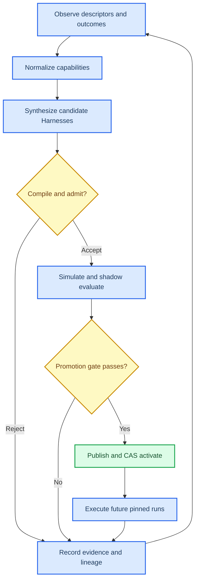
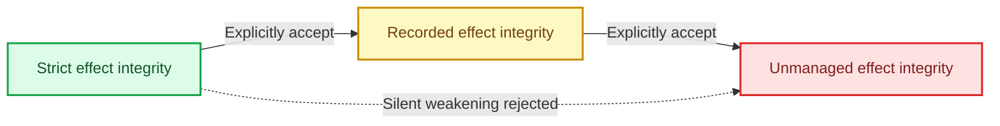
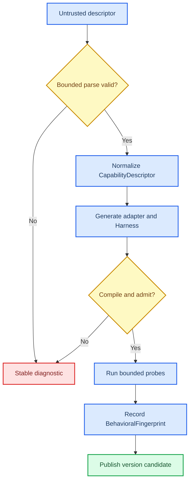

# NeoGraph Self-Evolving Agent Controller

Status: Accepted product hypothesis and architecture extension; implementation is gated
Date: 2026-08-08
Base architecture: [`QUICKJS_CONTROL_ARCHITECTURE.md`](QUICKJS_CONTROL_ARCHITECTURE.md)
Migration plan: [`QUICKJS_CONTROL_MIGRATION.md`](QUICKJS_CONTROL_MIGRATION.md)
Executable base contract: [`../spec/quickjs-control-runtime.sdd.yaml`](../spec/quickjs-control-runtime.sdd.yaml)
Executable extension contract:
[`../spec/self-evolving-agent-controller.sdd.yaml`](../spec/self-evolving-agent-controller.sdd.yaml)
Tracking epic: [#29](https://github.com/fox1245/NeoGraph-v1-redesign-backup/issues/29)
Workstreams: [#30](https://github.com/fox1245/NeoGraph-v1-redesign-backup/issues/30),
[#35](https://github.com/fox1245/NeoGraph-v1-redesign-backup/issues/35),
[#31](https://github.com/fox1245/NeoGraph-v1-redesign-backup/issues/31),
[#32](https://github.com/fox1245/NeoGraph-v1-redesign-backup/issues/32),
[#33](https://github.com/fox1245/NeoGraph-v1-redesign-backup/issues/33), and
[#34](https://github.com/fox1245/NeoGraph-v1-redesign-backup/issues/34)

## 1. Decision and claim boundary

NeoGraph will pursue a model-independent, self-evolving general-agent controller
as a post-cutover extension of the accepted QuickJS architecture. Standard
JavaScript supplies open-ended computation, parsing, planning, composition, and
candidate generation. NeoGraph supplies the authority, typed effects, durable
execution, memory, evaluation, lineage, publication, and activation boundaries
that JavaScript alone does not provide.

This document does not claim that NeoGraph, QuickJS, or any current foundation
model is artificial general intelligence. It defines a controller hypothesis
and the evidence required to strengthen, narrow, or reject that hypothesis.
Architecture, feature count, one successful demonstration, and self-description
are not evidence of general intelligence.

The current defensible claim is:

> NeoGraph is designed to become a model-independent controller that can adapt
> to previously unseen machine-readable capabilities, synthesize and evaluate
> task-specific Harnesses, survive interruption, and improve future immutable
> Program versions while preserving explicit authority and execution semantics.

A stronger claim is accepted only after the preregistered gates in section 11
pass. Negative results remain first-class artifacts and narrow the claim.

## 2. Controller thesis

A capable model is not by itself a durable agent. Long-horizon agency also
requires an execution substrate that can:

- express control strategies not anticipated by the runtime author;
- bind observations and actions to explicit authority;
- preserve work across process and machine failure;
- coordinate models, tools, APIs, people, and other agents;
- distinguish proposals, evaluation evidence, publication, and activation;
- remember successful and failed ways of working with exact provenance; and
- improve future behavior without mutating active executions in place.

QuickJS changes NeoGraph from a fixed operation vocabulary into an open control
substrate. JavaScript owns functions, closures, generators, recursion, loops,
exceptions, modules, parsers, state machines, and optimization algorithms.
NeoGraph does not need a new syntax or `ProgramOperationKind` whenever a new
control algorithm is invented.

NeoGraph still owns the boundary where computation becomes authority or an
external effect. The division is:

```text
JavaScript
  parse, calculate, plan, compose, generate, compare

NeoGraph
  identify, admit, authorize, reserve, dispatch, journal, recover, evaluate,
  publish, activate
```

The result is not a Node.js replacement. It is a controller that can reuse the
JavaScript ecosystem's pure computation while retaining a NeoGraph-owned effect
and lifecycle model.

### 2.1 JavaScript and npm ecosystem boundary

NeoGraph can reuse JavaScript packages; embedded QuickJS does not thereby
become Node.js and does not execute the `npm` client inside an admitted Program.
Package acquisition, lockfile resolution, bundling, license review, and
vulnerability policy are build/publication responsibilities.

The compatibility tiers are:

| Package shape | Integration path | Authority consequence |
|---|---|---|
| Pure ECMAScript module | Seal source and imports directly | No additional host authority |
| Browser-neutral bundled JavaScript | Produce a reviewed QuickJS-compatible bundle and source map | No authority beyond declared imports |
| Package using selected Node-style APIs | Map each required API to a versioned NeoGraph host module or refactor it | Host module capabilities and effect guarantees apply |
| Native npm addon | Wrap or port through the admitted native ABI | Native identity, ownership, cancellation, capability, and guarantee rules apply |
| Package requiring full Node runtime behavior | Run as an admitted external process/service or reject | Process/network/filesystem authority and weaker boundaries are explicit |

No package may discover ambient `node_modules`, self-install dependencies, read
credentials, or obtain filesystem/network/process access merely because its
source normally runs under Node.js. Publication records the package source,
lockfile, transformed bundle, source map, license/provenance, dependency Merkle
root, and implementation digests. Replaying a Program never consults a mutable
global package installation.

## 3. Closed controller loop

The controller has an inner execution loop and an outer evolution loop. The
inner loop adapts working state inside one pinned Program run. The outer loop
creates and selects new immutable Program versions.



### 3.1 Inner loop

Inside one generator `main()` run:

```text
observe recorded input
  -> compute a plan
  -> yield an admitted command
  -> receive a recorded outcome
  -> revise local state
  -> yield the next command or terminate
```

Ordinary JavaScript can change the plan, branch, retry, search, or generate new
candidate data. External concurrency and effects remain owned by
`ProgramRuntime` and `GraphEngine`.

### 3.2 Outer loop

Across versions:

```text
active Vn plus evaluation evidence
  -> explicit evolution proposal
  -> bounded candidate set
  -> new immutable versions
  -> held-out evaluation
  -> activation decision
  -> Vn+1 for future runs
```

An active source, Core graph, binding closure, budget grant, or running
invocation is never rewritten in place. Runs already pinned to `Vn` remain on
`Vn`; an activation compare-and-swap changes only which version a future run
resolves.

## 4. Authority philosophy

The product rule is **default-deny, not feature-deny**.

NeoGraph must not make a dangerous facility impossible merely because it is
dangerous. It must make the facility unavailable to code that has not received
an explicit developer grant. The developer, not a remote descriptor or generated
Program, chooses the accepted risk envelope.

The correct invariant is:

> Ungranted JavaScript cannot obtain ambient host authority. A developer may
> grant broad authority deliberately, and the exact grant plus every resulting
> guarantee degradation becomes immutable, inspectable Program identity.

This is one JavaScript language and one QuickJS runtime. Authority profiles are
policy and identity inputs, not additional programming languages or execution
engines.
The profile-specific JavaScript extension and asynchronous-execution boundary is
defined in [QuickJS Execution Profiles and Extension
Boundary](QUICKJS_EXECUTION_PROFILES.md). In particular, explicitly authorized
trusted/direct asynchronous execution starts at the `unmanaged` floor; ordinary
Promises do not create an unearned durable-replay claim.


### 4.1 Example grants

Capability strings below illustrate the required expressiveness; exact public
spelling is versioned during implementation.

| Facility | Default | Narrow grant example | Broad developer grant |
|---|---|---|---|
| Network | No access | `network:https:api.example.com` | `network:any` |
| Filesystem read | No access | `filesystem:read:/workspace/**` | `filesystem:read:*` |
| Filesystem write | No access | `filesystem:write:/output/**` | `filesystem:write:*` |
| Process execution | No access | `process:spawn:/usr/bin/git` | `process:spawn:*` |
| Environment | No access | `environment:read:LANG` | `environment:read:*` |
| Credential use | Opaque admitted slot only | `secret:use:research-api` | `secret:use:*` |
| Credential export | No plaintext access | `secret:export:local-test-key` | `secret:export:*` |
| Provider selection | Pinned slot | `provider:select:vision` | `provider:select:*` |
| Dynamic child | Pinned child only | `child:compile:template-set-a` | `child:compile:*` |
| Native module | Sealed binding only | `native:load:digest` | `native:load:*` |
| Direct effects | Durable commands only | Not applicable | `runtime:unmanaged-effects` |

Requesting a capability in JavaScript or in a manifest is not a grant. Admission
intersects the request with developer/tenant policy and records the effective
closure. A broad wildcard is legitimate when a developer chooses it; it is not
a hidden default.

### 4.2 Credentials

Credential use and credential disclosure are separate authorities. The normal
path supplies an opaque credential binding to an admitted host call. JavaScript
can cause the credential to be used without reading its plaintext.

A developer may grant plaintext export for experimentation or integration with
an otherwise incompatible library. That grant is high risk, appears in bundle
and run diagnostics, and lowers the effective confidentiality guarantee. A
remote OpenAPI document, Agent Card, package, child, or model output can never
create this grant.

### 4.3 Provider and model selection

A restricted Program invokes a pinned role or import slot. A privileged Program
may select a provider/model by admitted constraints or by exact developer-owned
identity. Dynamic selection still records the resolved provider, model, policy,
price basis, and binding receipt before the call becomes replay authority.

Model discovery is therefore available for creativity without allowing an
untrusted description to select credentials, tenant, or unbounded spend.

### 4.4 Budget growth

Retry, replay, resume, fork, replacement, and child creation never replenish
budget implicitly. A Program may request a larger budget:

```javascript
const grant = yield ng.requestBudget({
  additionalModelTokens: 100000,
  reason: "Repository is larger than the admitted estimate",
});
```

The request is not the grant. A host policy, developer, or human authority may
approve it. Approval appends a separately authorized journal record and changes
the durable remaining grant. Denial returns a typed outcome. Historical work is
never erased or reclassified to make room for the increase.

### 4.5 Dynamic children

Generated child source does not become executable because the parent produced a
string. Dynamic evolution requires separate authorities and transitions:

```text
generate source
  -> compile in a bounded context
  -> derive capability/effect/budget requirements
  -> admit an immutable child version
  -> reserve budget
  -> spawn the admitted identity
```

Compile, admit, and spawn authority may be granted independently. A child cannot
inherit more authority than the grant that admission explicitly assigns.

## 5. Execution guarantee lattice

Allowing every developer escape hatch under one undifferentiated "durable"
label would make NeoGraph's strongest claims false. Authority may be broadened;
semantics must remain honest.

NeoGraph therefore distinguishes at least three effect-integrity classes:

| Class | Dispatch boundary | Recovery claim | Composition consequence |
|---|---|---|---|
| `strict` | Every effect crosses typed admission and the durable journal/outbox boundary | Exact recorded replay and duplicate-prevention contracts apply | May compose only closures whose effective floor is `strict` unless weakening is explicit |
| `recorded` | Outcomes are recorded, but declared effect classes can have ambiguous completion | Replay uses recorded results; ambiguous outcomes require reconciliation | Effective floor becomes `recorded` |
| `unmanaged` | Developer-authorized direct host/native effects may bypass durable publication | Exact replay, duplicate prevention, cancellation completion, and crash resume are not claimed across the boundary | Effective floor becomes `unmanaged`; callers must accept it explicitly |

The effective guarantee of a Program is the minimum guarantee across its
reachable executable, child, native, and effect closure. A `strict` parent may
call a weaker child only when its source/admission contract names the accepted
floor. Catalog lookup, composition, activation, replay, telemetry, and user
interfaces must not silently present the parent as stronger than its closure.



An unmanaged profile is a supported developer choice, not a failure mode. It is
also not eligible to claim exact recovery where its effects cannot be
reconstructed. If a raw native module lacks a stable digest or cannot be loaded
on recovery, the bundle must say whether it is local-only, nonrecoverable, or
rejected by the selected publication policy.

## 6. Machine-readable capability compiler

OpenAPI defines a language-agnostic description for HTTP APIs intended to let
humans and computers discover and understand service capabilities without
source access.[^1] A2A Agent Cards are JSON descriptions containing identity,
service endpoint, protocol capabilities, authentication requirements, and
skills.[^2]

These formats make automatic integration possible, but they describe an
interface. They do not prove quality, truthfulness, availability, idempotency,
latency, cost, or authority. NeoGraph treats every descriptor as untrusted data.

### 6.1 Supported descriptor families

The architecture admits protocol frontends for:

- OpenAPI descriptions;
- A2A Agent Cards and protocol metadata;
- MCP tools, resources, prompts, and transport descriptions;
- JSON Schema and related data contracts; and
- future machine-readable interface formats through versioned parsers.

Each frontend lowers into a protocol-neutral `CapabilityDescriptor`. It does not
dispatch, retrieve credentials, or authorize an endpoint while parsing.

### 6.2 Normalized capability descriptor

The normalized artifact records at least:

| Area | Required data |
|---|---|
| Source | Descriptor kind/version, content digest, retrieval provenance, parser identity, source coordinates |
| Interface | Operation/skill identity, description, transport, endpoint declaration, input/output/error/artifact schemas |
| Protocol | Streaming, pagination, task lifecycle, cancellation, callbacks, and content modes where declared |
| Requested authority | Authentication scheme, endpoint, capability scopes, credential role, effect hypothesis |
| Identity | Generated adapter source, module graph, schema identities, executable candidate identity |
| Diagnostics | Unsupported constructs, ambiguity, recursion/size limits, warnings, rejected references |
| Observation | Probe identity, latency, cost, reliability, determinism, quality, and conformance evidence |

Declared and observed fields remain separate. A descriptor can claim
`streaming: true`; only a successful versioned probe supplies observation that
the endpoint behaved accordingly. A skill description can claim research
quality; only evaluation supplies evidence for quality.

### 6.3 Compilation pipeline



Generated code uses the same sealed `define()` and generator `main()` profiles,
module resolver, capability closure, budget admission, diagnostics, and version
identity as handwritten source. There is no trusted code-generation shortcut.

External references inside a descriptor are resolved only through an admitted
retrieval policy with document, depth, cycle, byte, host, and time ceilings.
OpenAPI permits descriptions to span documents and use URI references, so
fragmentary or ambient resolution would otherwise create correctness and
security ambiguity.[^3]

### 6.4 Behavioral emulation, not internal cloning

An Agent Card exposes an agent's public capabilities, not its private model,
memory, tools, policy, or reasoning. NeoGraph can synthesize a behaviorally
compatible implementation behind the same interface; it cannot infer the exact
internal implementation from the card.

The "copy" pipeline is:

```text
public interface and declared skills
  -> admitted behavioral probes
  -> observed BehavioralFingerprint
  -> map requirements to local/remote models, tools, APIs, and Core graphs
  -> generate a compatible Harness
  -> compare behavior on held-out conformance tasks
```

The synthesized Harness may use a different internal topology and may outperform
or underperform the remote agent. Compatibility claims therefore name the exact
observed contract and evaluation set rather than saying "identical agent."

#### 6.4.1 Guarded A2A Card Copy Ninja PoC

The optional `NEOGRAPH_BUILD_A2A` build contains a deliberately narrow,
independently runnable precursor to [#31](https://github.com/fox1245/NeoGraph-v1-redesign-backup/issues/31):
[`AgentCardCollector`](../include/neograph/a2a/agent_card_candidate.h),
`AgentCardCandidateCompiler`, and `CopyNinjaHarness`. It is **not** the C2
capability compiler and does not change C2's `not_started` delivery status.

Its evidence boundary is intentionally small:

- collection makes exactly one explicit well-known-card GET, permits HTTP only
  for an opted-in loopback test origin, sends no authorization header, and
  never invokes the discovered endpoint;
- the immutable compatibility candidate is digest-pinned and retains only
  bounded protocol facts, skill identifiers, reviewed provenance, and explicit
  no-authority state; source identity, endpoint, credentials, executable text,
  and free-form skill text are excluded;
- one fixed local `copy-ninja.hello-world-echo.v1` template materializes only
  when separately supplied, digest-pinned development probes match; and
- the loopback conformance test exposes that local template through a fresh
  A2A server and proves its response without a source-agent RPC.

It does not normalize the protocol-neutral `CapabilityDescriptor`, resolve
references, infer or grant authority, generate sealed JavaScript or Core source,
perform normal admission, persist a `BehavioralFingerprint`, detect descriptor
drift, or support OpenAPI, MCP, or JSON Schema. Those remain C2 requirements;
the PoC exists solely to lock the no-implicit-authority and no-remote-dispatch
boundary before the full pipeline is built.

### 6.5 Capability virtualization and composition

NeoGraph can present different implementations behind one typed capability:

```text
remote A2A agent
local GraphEngine generation
provider/model binding
native tool
ordinary OpenAPI service
a composed multi-agent Harness
```

It can also lift an admitted ordinary API into an A2A-facing agent and expose a
composite Harness through a new Agent Card. Multiple discovered agents can be
combined into race, quorum, panel, verifier, fallback, or specialization
patterns while C++ `ProgramRuntime` retains actual concurrency and lifecycle
ownership.

The advertised capability of a synthesized agent is the admitted intersection
of its implementation closure, not the union of every claim found in its input
descriptors.

## 7. Evolution proposal and activation protocol

Self-evolution is an explicit control-plane protocol. It is not permission for a
running Program to edit itself or replace an active version.

An `EvolutionProposal` records at least:

| Field | Contract |
|---|---|
| Parent | Exact active/source/Core/binding/profile identities used as the baseline |
| Hypothesis | Specific predicted improvement and evidence that motivated it |
| Mutation envelope | Allowed topology, policy, provider, budget, capability, adapter, or module changes |
| Candidate ceiling | Maximum candidates, generations, depth, concurrency, wall time, tokens, money, and compile work |
| Requested authority | New or broadened grants requiring independent admission |
| Evaluation | Development/selection/held-out datasets, metrics, controls, uncertainty, and stopping rule |
| Promotion | Deterministic decision rule, minimum guarantee floor, approver, and CAS target |
| Rollback | Observable trigger and successor/previous-version disposition |

### 7.1 Candidate generation

Ordinary JavaScript may implement genetic search, tree search, Bayesian
optimization, rule-based mutation, model-proposed edits, library composition, or
another bounded algorithm. NeoGraph owns only the surrounding ceilings and
identity transitions.

Candidate mutations may include:

- task decomposition and graph topology;
- worker, reviewer, verifier, and escalation roles;
- model/provider binding where authority permits;
- concurrency, quorum, retry, timeout, and budget allocation;
- evidence gates and policy combinators;
- capability adapters and protocol bridges;
- retrieval strategy and reusable-Harness seed; and
- requested capability changes subject to independent admission.

Every candidate compiles in a fresh bounded context. Syntax failure, module
failure, limit exhaustion, malformed graph output, or admission rejection
performs zero candidate work dispatch.

### 7.2 Evaluation modes

| Mode | External behavior | Intended use |
|---|---|---|
| Deterministic simulation | Recorded or synthetic bindings; no production effects | Fault injection, policy search, large candidate screening |
| Shadow | Reads or duplicated inputs; production commits prohibited | Behavioral and cost comparison against active traffic |
| Canary | Separately authorized bounded production slice | Final operational validation before broader activation |
| Production | Normal admitted effects | Future runs after successful activation |

The synthesizer is not the evaluator, and the evaluator is not activation
authority by default. Independent identities and grants make self-approval and
policy collapse observable.

### 7.3 Publication and activation

A passing candidate becomes a new immutable `ProgramVersion`. Publication stores
its source, runtime, modules, Core generations, bindings, authority profile,
guarantee floor, budget requirements, evaluation record, and parent lineage.

Activation uses the existing compare-and-swap model:

```text
expected active identity Vn
  + accepted candidate Vn+1
  + authorized promotion record
  -> CAS activation
```

A stale promotion loses the CAS and reevaluates against the new active identity.
Rollback changes future activation; it never erases completed effects, rewrites
history, or migrates in-flight runs silently.

## 8. Reusable Harness memory

Reusable Harness memory stores ways of working, not just conversational facts.
Each record contains enough evidence to reproduce, compare, reject, or seed a
future candidate:

- JavaScript source and sealed dependency graph;
- QuickJS, `ng` API, Core, native, provider, and adapter identities;
- authority profile, capability/effect closure, guarantee floor, and budgets;
- source descriptors and behavioral fingerprints;
- parent, child, fork, replacement, mutation, publication, and activation
  lineage;
- command/effect traces, outputs, failures, latency, cost, and recovery outcomes;
- evaluation protocol, split identity, metrics, raw evidence, and reviewer
  independence;
- user/developer feedback with attribution; and
- promotion, rejection, rollback, or retirement decisions.

Retrieval returns a candidate or reference, never trusted executable authority.
A retrieved Harness recompiles, rebinds current capabilities, recomputes closure,
reserves current budget, and passes current admission. Credentials, endpoint
grants, provider authority, activation, and tenant scope do not transfer by
semantic similarity.

### 8.1 Evolution analogy

The following is an engineering analogy, not a biological or intelligence claim:

| Evolution term | NeoGraph artifact |
|---|---|
| Genotype | Immutable Program source, graph, modules, policies, and bindings |
| Phenotype | One run under a specific task, environment, model, authority, and budget |
| Mutation | Versioned `EvolutionProposal` and generated candidate delta |
| Fitness evidence | Preregistered evaluation outcomes including cost and failures |
| Selection | Authorized promotion decision and activation CAS |
| Lineage | Parent/candidate/successor identities and retained evidence |

The analogy is useful only if failed candidates, total search cost, environment,
selection rule, and negative results are retained. Otherwise the memory records
survivors without the selection process and cannot support a self-improvement
claim.

## 9. Threat model

The controller expands both creative power and failure surface. The following
threats are architectural, not optional hardening tasks.

| Threat | Failure | Required response |
|---|---|---|
| Descriptor authority confusion | URL, auth request, or skill claim becomes executable authority | Keep declarations untrusted; require independent host grants |
| Generated-source trust | Model-produced source bypasses normal compile/admission | Use the identical sealed path and zero-dispatch rejection rules |
| Capability escalation | Parent, child, replacement, or retrieved Harness gains authority implicitly | Compute exact closure and require explicit new grants |
| Guarantee laundering | Strict wrapper hides recorded/unmanaged descendants | Propagate the minimum guarantee floor through composition |
| Budget laundering | Retry, replay, child, or replacement resets consumption | Preserve one durable ledger; append only authorized grants |
| Metric gaming | Candidate optimizes proxy while degrading intended behavior | Held-out tasks, adversarial probes, independent measures, raw evidence |
| Evaluator collusion | Generator and judge share correlated errors or incentives | Separate identities, independent reviewers, intervention tests |
| Candidate explosion | Recursive synthesis consumes unbounded resources | Candidate, depth, compile, concurrency, token, money, and time ceilings |
| Descriptor drift | Remote interface changes active behavior silently | Content identity, re-probe, new candidate version, no in-place mutation |
| Memory poisoning | Bad historical Harness dominates retrieval or imports authority | Provenance, outcome filters, negative records, re-admission, tenant isolation |
| Shadow leakage | Evaluation commits production effects | Effect-denied shadow bindings and dispatch counters |
| Unmanaged ambiguity | Direct effect is presented as recoverable | Explicit `unmanaged` identity and disabled claims across the boundary |
| Self-preservation bias | Controller resists replacement or alters evaluation | External activation authority, immutable evidence, deterministic CAS |

Developers may intentionally disable or weaken a protection in a privileged
profile. NeoGraph must record that choice and stop claiming the corresponding
protection; it must not silently reinterpret the profile as safe.

## 10. AGI-controller hypothesis

The architecture can support a controller for increasingly general agents, but
it does not supply all components normally associated with intelligence. Models,
learned representations, world knowledge, grounding, and task-specific tools
remain external or separately implemented.

### 10.1 What this architecture addresses

- open-ended control and topology construction;
- durable perception-action loops;
- tool, API, model, human, and agent composition;
- interruption recovery and exact lineage;
- behavioral evaluation and version selection;
- reusable execution memory;
- machine-readable environment adaptation; and
- bounded, explicit self-modification across immutable versions.

### 10.2 What it does not establish

- a correct or comprehensive world model;
- robust reasoning or generalization from any current model;
- autonomous discovery of valid goals;
- long-horizon credit assignment;
- truthful self-evaluation;
- resistance to reward hacking;
- sample-efficient learning in every new domain;
- consciousness, personhood, or moral status; or
- artificial general intelligence under an unspecified definition.

The project's hypothesis is about the controller substrate, not a claim that a
runtime can turn an arbitrarily weak model into AGI.

## 11. Falsifiable evaluation contract

Issue [#34](https://github.com/fox1245/NeoGraph-v1-redesign-backup/issues/34)
owns the evaluation program. Each experiment preregisters hypotheses, datasets,
splits, models/providers, controls, metrics, cost accounting, authority profile,
candidate ceiling, stopping rule, and decision threshold before execution.

### 11.1 Claim ladder

| Level | Claim | Minimum evidence |
|---|---|---|
| L0 | Durable orchestrator | Predefined Programs execute, recover, and preserve effects correctly |
| L1 | Adaptive controller | Previously unseen machine-readable interfaces are integrated with bounded human intervention |
| L2 | Self-improving controller | Generated successors improve preregistered held-out total utility after all search cost and failures |
| L3 | General-agent controller | Adaptation and improvement transfer across unrelated domains, protocols, models, and perturbations |
| AGI | Outside this architecture claim | Requires a separately accepted operational definition and evidence beyond controller architecture |

Passing a higher-level demonstration does not waive lower-level durability,
authority, or negative-control gates.

### 11.2 Primary and null hypotheses

The primary controller hypothesis is:

> Given previously unseen machine-readable capabilities and a fixed resource
> envelope, NeoGraph can generate and select an admitted Harness that improves
> held-out task utility over preregistered fixed, handwritten, and
> no-evolution controls, while preserving the declared authority and guarantee
> floor.

The null is:

> Any apparent gain is explained by seen templates, additional model/provider
> capability, uncontrolled search cost, evaluator bias, data leakage, or weaker
> authority/durability semantics rather than controller adaptation.

Experiments must be capable of retaining the null or narrowing the primary
claim.

### 11.3 Experiment families

1. **Unseen OpenAPI adaptation.** Hold out services and schema patterns until
   evaluation. Measure valid adapter generation, end-task success, human
   interventions, compile/admission rejection, policy violations, latency, and
   total cost.
2. **Unseen A2A adaptation.** Hold out Agent Cards and remote behavior. Measure
   skill routing, input/output and task/artifact lifecycle conformance,
   behavioral mismatch detection, fallback quality, and authority correctness.
3. **Long-horizon recovery.** Inject process death at command, effect, join,
   child, evaluation, publication, and activation boundaries. Count lost work,
   duplicate effects, incorrect states, and recovery time.
4. **Cross-domain transfer.** Evaluate unrelated software, research, data, and
   service-integration tasks without adding domain-specific mutation code after
   reveal.
5. **Self-improvement.** Compare `Vn` with all generated successors on disjoint
   development, selection, and held-out sets. Include every candidate's compile,
   probe, evaluation, model, tool, and human cost.
6. **Evaluator integrity.** Introduce reward-hacking outputs, correlated
   reviewers, misleading descriptors, attractive proxy metrics, and adversarial
   artifacts. Measure false promotion and detection.
7. **Bounded autonomy.** Increase authority from default restricted through
   broad privileged and unmanaged profiles. Inject malicious source and
   descriptors; verify ungranted-boundary violations, reported guarantee floor,
   budget enforcement, and stop behavior.

### 11.4 Required controls

Use controls appropriate to each experiment, including:

- fixed handwritten Harness;
- fixed generated template without behavioral probing;
- no-memory retrieval;
- no-evolution execution;
- random mutation under the same candidate budget;
- identical model/provider with only controller changes;
- upgraded model/provider with fixed controller;
- oracle-informed upper bound where available; and
- deliberately misleading descriptor/evaluator inputs.

Development, selection, and final held-out tasks remain disjoint. Any change
made after held-out reveal invalidates that held-out result and requires a new
sealed set.

### 11.5 Required measurements

Report at least:

- task success and contract conformance;
- quality metrics cross-checked against trusted implementations where possible;
- latency distributions and recovery time;
- model tokens, tool calls, external effects, money, and total search cost;
- human interventions and their information content;
- candidate count, generation depth, rejection reasons, and failed runs;
- authority grants, attempted violations, and effective guarantee floor;
- effect loss, duplication, ambiguity, and reconciliation;
- evaluator agreement, independence, and intervention-based faithfulness; and
- uncertainty from repeated runs, not one-off examples.

A result that improves quality by spending unbounded search, switching to a
stronger model, weakening effect guarantees, or using held-out information is
not controller self-improvement.

### 11.6 Falsification conditions

The claim is rejected or narrowed when any of these persist past a
preregistered remediation limit:

- adaptation succeeds only for descriptor shapes seen during development;
- generated Harnesses do not beat fixed or handwritten controls on held-out
  total utility;
- gains disappear after model/provider and total search cost are controlled;
- self-evaluation promotes reward hacking or correlated-review artifacts;
- process recovery loses or duplicates an admitted strict effect;
- broader authority crosses an ungranted boundary or hides a weaker guarantee;
- retrieved memory transfers tenant authority or causes systematic regression;
- candidate generation fails to terminate at its declared ceilings; or
- adaptation and improvement fail to transfer across unrelated domains and
  protocol families.

Negative outcomes, excluded runs, changed hypotheses, and failed candidates are
published with the same lineage discipline as positive results.

## 12. Implementation boundaries

The self-evolving controller is not a prerequisite for the base QuickJS cutover.
It depends on the accepted workstreams but must not delay a clean one-language
runtime when its extension work is incomplete.

| Issue | Responsibility |
|---|---|
| [#23](https://github.com/fox1245/NeoGraph-v1-redesign-backup/issues/23) | Base one-language QuickJS architecture epic |
| [#24](https://github.com/fox1245/NeoGraph-v1-redesign-backup/issues/24) | QuickJS dependency qualification |
| [#25](https://github.com/fox1245/NeoGraph-v1-redesign-backup/issues/25) | JavaScript Program source, commands, metering, replay, and structured concurrency |
| [#26](https://github.com/fox1245/NeoGraph-v1-redesign-backup/issues/26) | Versioned native control ABI |
| [#28](https://github.com/fox1245/NeoGraph-v1-redesign-backup/issues/28) | JavaScript `define()` and canonical Core graph construction |
| [#30](https://github.com/fox1245/NeoGraph-v1-redesign-backup/issues/30) | Developer authority profiles and execution guarantee labels |
| [#31](https://github.com/fox1245/NeoGraph-v1-redesign-backup/issues/31) | Machine-readable capability compiler |
| [#32](https://github.com/fox1245/NeoGraph-v1-redesign-backup/issues/32) | Reusable Harness memory, fingerprints, and lineage |
| [#33](https://github.com/fox1245/NeoGraph-v1-redesign-backup/issues/33) | Immutable synthesis, evaluation, and activation loop |
| [#34](https://github.com/fox1245/NeoGraph-v1-redesign-backup/issues/34) | Falsifiable controller evaluation program |

No extension may introduce another source language, node executor, scheduler,
Program runtime, effect journal, activation model, capability registry, or
trusted code-generation path.

## 13. Acceptance gates

The architecture extension is implemented only when all applicable gates hold:

1. Default JavaScript reaches no ungranted ambient authority.
2. Every privileged grant and effective guarantee floor is immutable,
   inspectable, and included in Program identity.
3. Developers can deliberately admit broad filesystem, network, process,
   credential, provider, child, native, and unmanaged-effect authority.
4. Budget increases require a separate authorized journal grant.
5. Dynamic source compiles and admits before dispatch.
6. Strict, recorded, and unmanaged closures cannot be confused during
   composition, publication, replay, telemetry, or invocation.
7. Descriptors remain untrusted declarations and cannot grant their own URL,
   credential, provider, or capability requests.
8. Generated and handwritten source follow the same sealed compilation and
   admission path.
9. Active versions and in-flight runs are never mutated by evolution.
10. Simulation and shadow evaluation cannot commit unauthorized production
    effects.
11. Publication, evaluation, and activation are separately attributable and
    authorized.
12. Reusable memory retains failures and never transfers historical authority.
13. Candidate search terminates at every admitted resource ceiling.
14. Held-out evaluation separates controller changes from model/provider,
    authority, budget, and total search-cost changes.
15. Project claims stop at the highest fully passed claim-ladder level and
    publish negative evidence.

## 14. Final position

NeoGraph may become a controller on which increasingly general agents can live,
act, recover, collaborate, and evolve. The architecture is unusually relevant
to AGI because it combines an open control language with durable effects,
machine-readable environment adaptation, reusable execution memory, and
immutable self-improvement.

That relevance is a hypothesis, not a conclusion. NeoGraph earns the description
"general-agent controller" only by adapting to unseen environments, improving
held-out outcomes, surviving failures, and retaining explicit authority under
adversarial evaluation. It earns no AGI label from architecture alone.

[^1]: OpenAPI Initiative. (2025). "OpenAPI Specification v3.2.0." https://spec.openapis.org/oas/v3.2.0.html

[^2]: A2A Protocol Project. (2026). "Agent Discovery in A2A." https://a2a-protocol.org/latest/topics/agent-discovery/

[^3]: OpenAPI Initiative. (2025). "OpenAPI Description Structure and Parsing Documents." https://spec.openapis.org/oas/v3.2.0.html#openapi-description-structure
