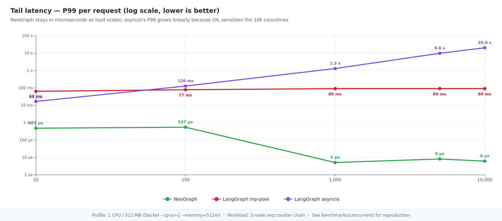
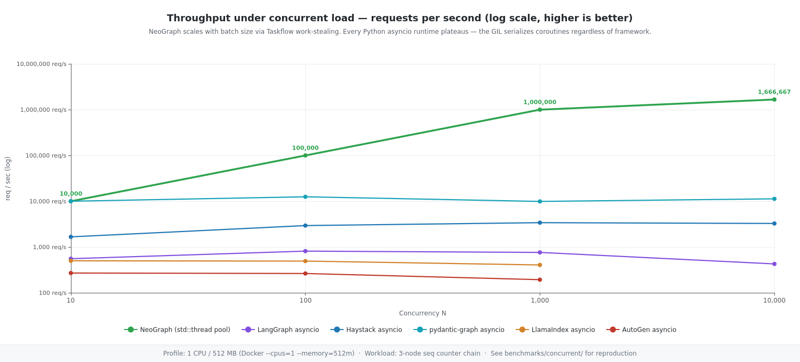
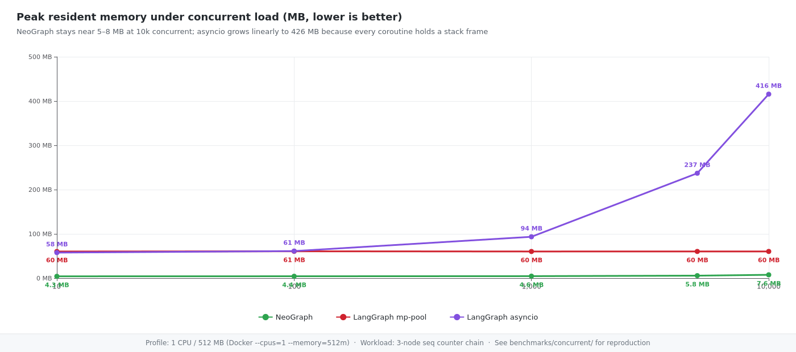

<!-- neograph-i18n: source=docs/performance-deep-dive.md locale=ko source_sha256=6420c556d0eca29b919ff60a7327ec851d1dab1488dddf29e215d7e427849a8a -->
**Languages:** [English](performance-deep-dive.md) | [한국어](performance-deep-dive.ko.md) | [日本語](performance-deep-dive.ja.md) | [简体中文](performance-deep-dive.zh-CN.md)

# 성능 심층 분석


> **성능** 및 **경량**에 대한 자세한 측정
> 축. README에는 헤드라인 번호가 있습니다. 이것이 완전한 증거입니다.

---

## 생산경제학

4개 지점(단일 깊이 트리, Docker 필요 없음, 고정된 ABI,
단일 휠 배포) 비용이 상당히 달라집니다.
실제로 AWS/GCP/Azure를 확장할 때의 구조입니다. 둘
메커니즘 — **자동 확장에 대한 차량 안전** 및 **당 작업자 수
인스턴스** — 숫자를 늘리세요.

### Heisenbugs 없이 자동 크기 조정

AWS의 LangChain에는 효과적으로 `docker image hash` 고정이 필요합니다.
스택 전체 — ECR-불변 이미지, ASG 출시
이미지 해시에 고정된 템플릿, 해당 템플릿의 다중 지역 복제
해시시. 그것이 없으면 모든 함대 변경 이벤트는 타이밍 폭탄입니다.

|이벤트|랭체인 위험|네오그래프 동작|
|---|---|---|
|ASG, 새로운 EC2 출시|`pip install`는 새로운 전이적 마이너 → 함대 동작 드리프트를 가져올 수 있습니다.|휠은 PyPI에서 해시 불변입니다. 새 인스턴스 = 바이트 동일 바이너리|
|람다 콜드 스타트|5~15초(`langchain-community` 가져오기 그래프)|ms-class — 전이적 가져오기가 없습니다.|
|스팟 중단 + Karpenter 재구축|OS 패키지 + 전이적 Python Dep Drift|정적 연결 C++; `libc.so.6`만이 중요합니다|
|Blue/green 배포|배포 시 재구축된 이미지 = 어제와 다른 런타임|`pip install neograph-engine==X.Y.Z`는 버전 문자열만으로 재현 가능합니다.|
|다중 지역 출시|PyPI 미러 지연 + ECR 복제 타이밍 → 지역이 분기됨|지역, 기간에 따른 휠 해시 평등|
|"코드 0 줄이 변경되어 제품이 손상되었습니다."|정기적으로 발생 (Pydantic v1→v2 / 2024)|구조적으로 불가능 - 표류할 전이 표면이 없음|

→ NeoGraph는 LangChain이 *요구하는* SOP를 제거합니다. 베어메탈
EC2 사용자 데이터 스크립트의 `pip install neograph-engine`는 그 자체입니다.
제품 등급.

### 인스턴스당 작업자 — RAM 측 델타

| |랭그래프|네오그래프|
|---|---|---|
|방금 수입됨(작업자 없음)|**80MB**|**5.5MB**|
|유휴 작업자 1024명|(일반적으로 OOM급)|**31MB**|
|작업자당 오버헤드(유휴, 사용자 상태 없음)|~200~500MB의 현실적인 프로덕션|~30KB 측정됨|
|t3.medium(4GB) — workers/instance| 7–17 | **700–3,500** |
|1,000개의 동시 요청에 필요한 인스턴스| 60–140 | **1–3** |
|us-east-1 지출(24/7, 온디맨드 t3.medium)|**~$1,800–4,300/mo**|**~$30–90/mo**|

이는 동일한 **50–150× 인프라 비용 비율**입니다.
동시 사용자 수. 작업자당 숫자 뒤에 숨은 메커니즘은 다음과 같습니다.
아래 L3 캐시 맞춤 이야기: NeoGraph의 핫 작업 세트는 277KB입니다.
N에 관계없이 수직 스케일 한도는 물리적 RAM에 의해 설정됩니다.
캐시 압력이 아닌 그 자체입니다.

> *"LangChain 런타임 비용: 1,000명의 동시 사용자에 대해 ~$4 K/mo.
> 네오그래프: ~$50/mo. 동일한 코드 모양, 동일한 LLM, 고정된 ABI."*

이는 SRE/플랫폼 팀이
프로덕션에서 LangChain을 거부합니다. "파이썬은 느리다"가 아니라
"비용 곡선으로 인해 SLA가 불가능해졌습니다."

### 측정: 동시 작업자 10,000명, 프로세스 1개, GPU 1개

위의 표는 보수적입니다. 직접 스트레스 테스트를 통해
실수 — *측정*, 추정되지 않음. 설정:

- 프로세스 1개, RTX 4070 Ti 1개, Gemma 4 E2B Q4 GGUF 1개(약 1.5GB)
llama.cpp를 통한 모델 가중치).
- 단일 공유 `LocalProvider` 직렬화 추론
GPU 경계(일반적인 "LLM 끝점은 다음을 나타냅니다.
병목 현상" 생산 모양).
- N개의 동시 NeoGraph 작업자, 각각 1노드 그래프 실행
(`llm_call` → `__end__`) `engine.run_async()`를 사용하면 모두
동일한 공급자를 놓고 경쟁합니다.
- 실제 생성: `"Hi"` 입력, 출력 예:
`"Hello! How can I help you today?\n"`.

|N명의 근로자|벽(들)|처리량(rps)|p50(밀리초)|p99 (밀리초)|피크 RSS(MB)|엔진 오버헤드(MB)|작업자당 증분|
|---:|---:|---:|---:|---:|---:|---:|---:|
| **1** | 0.64 | 1.6 | 642 | 642 | 2 464 | +294¹ | — |
| **10** | 0.94 | 10.6 | 184 | 686 | 2 529 | +359 |7.2 MB/worker|
| **100** | 4.81 | 20.8 | 343 | 855 | 2 549 | +379 |222 KB/worker|
| **1 000** | 44.1 | 22.7 | 347 | 673 | 2 564 | +394 |**6 KB/worker**|
| **5 000** | 213.7 | 23.4 | 338 | 657 | 2 570 | +400 |**1.2 KB/worker**|
| **10 000** | **424** | **23.6** | **337** | **648** | **2 572** | **+403** |**© 1 KB/worker**|

¹ 일회성 KV 캐시 + llama.cpp 활성화 버퍼. 상각
모든 N은 한 번 할당됩니다.

**숫자가 말해주는 것:**

- **10,000명의 작업자 비용은 1,000명의 작업자보다 RAM가 9MB 더 높습니다**
(2,564 → 2,572MB). 추가 근로자의 한계 비용
*약 1KB로 수렴됩니다* — `RunConfig` 크기에 a를 더한 크기
`thread_id` 문자열.
- **처리량은 23rps에서 GPU 경계입니다**, N = 100과 동일
N = 10,000. 엔진은 대기열에 10,000명의 유휴 작업자를 예약합니다.
7분 동안 벽에 붙어 있는 시간에는 아무런 영향을 주지 않습니다.
- **p99 대기 시간은 일정합니다**(N = 10,000에서 648ms vs N = 10에서 686ms).
대기열 깊이는 대기 시간을 누적하지 않습니다. 스케줄러가 릴리스됩니다.
GPU가 배수됨에 따라 작업자는 공정하게 작업합니다.
- **Workers/instance 한도는 물리적 RAM에 의해 설정되며,
엔진.** 32GB 호스트에서 N은 약 3천만 명의 작업자로 증가할 수 있습니다.
RAM가 포화되기 전에.

앞서 1K-worker LangGraph 비용 예측에 대해 암시적인
작업자당 가정은 200–500MB였습니다. **NeoGraph 측정값은 다음과 같습니다.
6KB.** 비율은 100×가 아니라 ≒ 30,000–80,000×입니다.

벤치마크 소스는 자매 프로젝트에 있습니다.
[`neoclaw`](https://github.com/fox1245/neoclaw):
[`benchmarks/bench_concurrent_workers_local_llm.cpp`](https://github.com/fox1245/neoclaw/blob/main/benchmarks/bench_concurrent_workers_local_llm.cpp).
`-DNEOCLAW_BUILD_BENCHMARKS=ON -DNEOCLAW_BUILD_CUDA=ON`로 재현하세요.

---

## L3 캐시에 적합한 에이전트 런타임

NeoGraph의 핫 코드 경로는 N개의 동시 에이전트가 공유할 만큼 작습니다.
하나의 L3 상주 작업 세트. Valgrind 캐시그라인드로 이를 측정했습니다.
Ryzen 7 5800X(Zen 3: 32KB L1i/d 8웨이, **32MB L3 16웨이**),
N = 1 → 10,000개의 동시 요청을 다음을 통해 스위핑합니다.
`benchmarks/concurrent/bench_concurrent_neograph`:

|N|나는 심판한다|**L3 명령 누락**|L3i 미스율|네이티브 p50|
|---:|---:|---:|---:|---:|
| 1 |530만| **4,313** | 0.08% |17μs|
| 10 |590만| **4,304** | 0.07% |16μs|
| 100 |11.8M| **4,320** | 0.04% |6μs|
| 1,000 |69.7M| **4,327** | 0.01% |6μs|
| 10,000 |**648백만**| **4,329** | **0.00%** |**5μs**|

**L3 명령 미스는 4개 주문 전체에서 ~4,320**으로 유지됩니다.
N의 크기. 고유한 핫 코드 작업 세트는 대략 다음과 같습니다.
`4,330 × 64 B = 277 KB` — **32MB L3의 0.85%**. N = 10,000에서
우리는 **6억 4,800만 개의 명령**을 처리했는데 그중 **4,329개만 처리했습니다.
DRAM**에 도달했습니다(150,000개의 지침당 1개의 누락).

N에 따라 기본 요청별 대기 시간이 17μs(콜드)에서 5μs(웜)로 감소합니다.
성장 — 3.4배 개선은 순수한 I-캐시 워밍업입니다. 처리량
N = 10,000은 단일 스레드 풀에서 ~1.1M req/s(5.2MB)입니다.
피크 RSS(약 100B/에이전트 한계 비용).

**이것이 중요한 이유:** Zen 3의 DRAM 액세스는 최대 250사이클인데 반해 Zen 3의 경우 최대 46사이클입니다.
L3 히트 — 액세스당 대략 5.5배 더 느립니다. NeoGraph의 워킹 세트라면
L3을 오버플로했습니다(Python 인터프리터 + 일반적으로 딕셔너리가 많은 상태).
), 동일한 N = 10,000 스윕은 **+420 ~ +840ms를 지불했을 것입니다.
측정된 **9ms 총 벽 시간** 대신 메모리 정지** —
미스 체인이 DRAM에 도달하는 정도에 따라 47~94배 더 느려집니다.
전체 L3는 *귀하의* 워크로드(대화 기록,
임베딩, 도구 응답): 엔진 자체는 반올림 오류입니다.

_낳다:_
```bash
g++ -std=c++20 -O2 -DNDEBUG -Iinclude -Ideps -Ideps/yyjson -Ideps/asio/include \
    -DASIO_STANDALONE benchmarks/concurrent/bench_concurrent_neograph.cpp \
    build-release/libneograph_core.a build-release/libyyjson.a -pthread -o bench_ng

valgrind --tool=cachegrind --cache-sim=yes \
    --I1=32768,8,64 --D1=32768,8,64 --LL=33554432,16,64 ./bench_ng 10000
```

### 루프에서 실제 LLM를 사용하여 엔드투엔드를 유지합니다.

L3 스토리는 풀스택 프로덕션에서도 살아남습니다. 우리는 NeoGraph를 다음과 같이 지적했습니다.
로컬로 호스팅되는 Gemma-4 E2B(Q4_K_M, 4.65B 매개변수, 2.9GB GGUF) 뒤에
OpenAI 호환 HTTP 엔드포인트 — NeoGraph 코드 변경이 전혀 없습니다.
`OpenAIProvider::Config::base_url = "http://127.0.0.1:8090"`와 명시적인
로컬 개발 옵션 `allow_insecure_loopback = true`만 바꿨다. 자세한 내용은
[`examples/31_local_transformer.cpp`](../examples/31_local_transformer.cpp).

| |퓨어 네오그래프|**NeoGraph + 로컬 Gemma(HTTP)**|
|---|---:|---:|
|L3 명령이 누락되었습니다.| 4,320 | **7,262** |
|핫 코드 작업 세트|277KB|**465KB**(L3의 1.42%)|
|요청별 TTFT| — |**25~27ms**(컬 기준선 9~10ms → ~15ms NeoGraph 오버헤드)|
|요청당 합계| — |146–213ms @ 19–27 토큰(~130 tok/s)|
|**NeoGraph 에이전트 RSS**|5.2MB|**7.6MB**(httplib + JSON 스트리밍의 경우 +2.4MB)|
|젬마 서버 RSS|n/a|2.45GB(mmap GGUF)|
|VRAM (RTX 4070 Ti)|n/a|3.06GB|

추론 프로세스는 **별도의 주소 공간**에 있으므로
2.5GB의 모델 무게는 NeoGraph의 L3 캐시 라인에 닿지 않습니다. 그만큼
에이전트의 465KB 작업 세트는 규모에 관계없이 L3 상주를 유지합니다.
모델은. 이것이 두 프로세스의 구조적 보상입니다.
분할: 에이전트를 팽창시키지 않고 70B 모델로 교체할 수 있습니다.

동일한 서버에 대해 5개의 동시 NeoGraph 에이전트를 사용하여 버스트 테스트를 거쳤습니다.
집계 벽 1.58초 / 5개 요청(코루틴에서 2.65배 속도 향상)
중복). 에이전트당 처리량은 대기열 압박으로 인해 감소합니다.
Gemma 서버는 지속적인 일괄 처리를 구현하지 않았습니다.
에이전트 문제가 아닌 추론 서버 문제입니다. 네오그래프 5개 모두 파견
리소스 압박 없이 깔끔하게 처리되었으며 RSS는 ~7MB로 유지되었습니다.

---

## 벤치마크

### 엔진 오버헤드와 Python graph/pipeline 프레임워크 비교

일치 토폴로지, zero-I/O 워크로드: 그래프가 한 번 컴파일되고
핫 루프. 엔진 자체의 비용을 측정합니다(디스패치, 상태
쓰기, 감속기 호출) — LLM 없음, 절전 없음, 네트워크 없음.


반복당 엔진 오버헤드(μs, 낮을수록 좋음). 모든 행
동일한 x86_64 Linux 호스트에서 2026-04-22를 측정했습니다. 네오그래프 내장
릴리스 `-O3 -DNDEBUG` 포함(10회 중앙값); Python 행은 3런입니다.
CPython을 통한 중앙값 3.12.3.

|뼈대|`seq`(3노드 체인)|`par`(팬아웃 5 + 조인)|`seq` 대 NeoGraph|
|-----------|---------------------:|-------------------------:|-------------------:|
|**네오그래프 마스터**|**5.0μs**|**11.8μs**| 1× |
|헤이스택 2.28.0|144.1μs|290.0μs| 28.8× |
|피단틱 그래프 1.85.1|235.9μs|286.1μs²| 47.2× |
|랭그래프 1.1.9|656.7μs|2,348.7μs| 131.3× |
|LlamaIndex 워크플로 0.14.21|1,780.3μs|4,683.5μs| 356.1× |
|AutoGen GraphFlow 0.7.5|3,209.2μs|7,292.7μs| 641.8× |

¹ pydantic-graph는 단일 다음 노드 상태 머신이며 팬할 수 없습니다.
밖으로; `par`는 직렬 6노드 에뮬레이션입니다.

전체 프로세스 지표(준비 + 두 워크로드, 10,000개 시퀀스 + 5,000개 매개변수):

| |네오그래프|최고의 Python (Haystack)|최악 (AutoGen)|
|---|----------|------------------------|-----------------|
|**총 경과 시간**|**~0.16초**|2.91초|68.29초|
|**피크 RSS**|**4.8MB**|80.3MB|52.4MB²|
|**병렬 팬아웃 실행자**|`asio::experimental::make_parallel_group`|단일 스레드 비동기(GIL)|단일 스레드 비동기(GIL)|

² AutoGen은 LlamaIndex보다 RSS가 작지만 반복당 비용은 더 작습니다.
64배 더 높습니다. 서로 다른 트레이드오프 축이 있습니다. 전체 행렬
[`benchmarks/README.md`](../benchmarks/README.md).

**LLM 대기 시간 동안 엔진 오버헤드가 사라집니다.** 500ms OpenAI 라운드
여행은 모든 엔진을 압도합니다. 반복당 간격은 LLM가 아닌 경우에만 나타납니다.
노드(데이터 변환, 라우팅 결정, 순수 컴퓨팅 도구 호출) 및
조밀한 에이전트 오케스트레이션에서. 그것이 나타나는 곳에는 크게 나타납니다.
Raspberry Pi 4/Jetson Nano/모든 SBC 클래스 대상, 10–20×
RAM 델타는 "적합"과 "스왑 스래시"의 차이입니다.

재생산 및 방법론: [`benchmarks/README.md`](../benchmarks/README.md).

### 버스트 동시성(1 CPU / 512MB 샌드박스)

수천 건의 동시 요청이 발생하면 어떻게 되나요? 버스트 테스트: N
t=0에서 각 엔진에 제출된 요청, 모두 입력/모두 대기, 내부
Docker cgroup은 **1 CPU 및 512MB RAM**로 제한됩니다. — 대략
Raspberry Pi 4 프로세스 예산.







asyncio 모드에서 **N=10,000 동시 요청**(기본값)
모든 Python 프레임워크의 배포 형태):

|엔진|벽|P99 대기 시간|피크 RSS|상태|
|--------|-----:|------------:|---------:|:-------|
|**네오그래프 마스터**|**52ms**|**7μs**|**5.5MB**| ✅ 10000 / 0 |
|피단틱 그래프|886ms|**158μs**|42.6MB| ✅ 10000 / 0 |
|커다란 건초 더미|3.1초|2.9초|130.7MB| ✅ 10000 / 0 |
|랭그래프|23.4초|23.0초|416.2MB| ✅ 10000 / 0 |
|라마인덱스| — | — | — |❌ **OOM가 사망했습니다**|
|자동 생성| — | — | — |❌ **OOM가 사망했습니다**|

**두 프레임워크가 완료되지 않음** — LlamaIndex Workflow 및 AutoGen
GraphFlow는 512MB cgroup을 소진하고 10k 이전에 OOM를 종료합니다.
동시 코루틴은 배수될 수 있습니다. 나머지 Python 프레임워크
죽기보다는 성능이 저하되지만 P99 대기 시간은 N에 따라 선형적으로 증가합니다.
CPython GIL는 모든 코루틴의 CPU 작업을 직렬화하기 때문입니다. **이것
LangGraph 특정 병리가 아닙니다** — 모든 Python에서 나타납니다.
비동기 런타임.

NeoGraph는 처리량 측면에서 모든 Python asyncio 런타임을 능가합니다.
테일 대기 시간 및 RSS: N=10k에서 7μs P99, ~76× RSS보다 낮음
LangGraph는 동일한 로드에서 3배 앞서 있습니다.
GIL 직렬화된 Python 곡선. 심지어 pydantic 그래프 — 가장 희박함
Python 상태 머신 — 158 µs P99 및 ~8× NeoGraph의 RSS에 위치합니다.

`multiprocessing.Pool` 모드는 작업자 프로세스 전체에서 GIL를 우회합니다.
그러나 풀 크기에 포화 상태이고 포크 + 피클 오버헤드를 지불합니다. 가득한
숫자와 MP 모드 이야기는
[`benchmarks/concurrent/CONCURRENT.md`](../benchmarks/concurrent/CONCURRENT.md).

### 크기 및 콜드 스타트 ​​설치 공간(계획 및 실행자 데모)

아래의 모든 수치는 x86_64 Linux(GCC 13)에서 다음을 사용하여 측정되었습니다.
`example_plan_executor` — 독립형 계획 및 실행자 데모
5방향 전송 팬아웃을 실행하고 첫 번째 실행에서 하위 주제 #2가 충돌합니다.
오류가 해결된 상태로 다시 시작됩니다. LLM 호출 없음, API 키 없음, 네트워크 없음.

|빌드 구성|크기|
|---|---|
|**MinSizeRel `-Os`, 정적 libstdc++, `--gc-sections`, 제거됨**|**1,203KB(1.2MB)**|

MinSizeRel 바이너리의 유일한 동적 종속성은 `libc.so.6`입니다.
`libstdc++` 및 `libgcc_s`는 정적으로 연결됩니다. 아무데나 떨어뜨리세요
libc가 일치하는 Linux 호스트가 실행됩니다.

|미터법|값|
|---|---|
|Peak RSS(전체 계획 및 실행기 실행, 충돌 + 재개 포함)|**2.9MB**|
|벽시계(콜드 스타트 ​​→ 두 단계 모두 완료)|**~720ms**|
|동적 종속성|`libc.so.6` 전용|

`example_plan_executor`는 전송 대상당 120ms 동안 휴면 상태를 유지하여
LLM 호출. 이 예에서는 다음을 통해 하드웨어 크기의 팬아웃 풀을 선택합니다.
`EngineConfig::worker_count`는 `GraphEngine::build()`보다 먼저이므로 5개
대상이 동시에 실행됩니다. 정상 상태 RSS는 영향을 받지 않습니다.

```bash
cmake -B build-minsize -S . \
    -DCMAKE_BUILD_TYPE=MinSizeRel \
    -DNEOGRAPH_BUILD_MCP=OFF -DNEOGRAPH_BUILD_TESTS=OFF -DNEOGRAPH_BUILD_POSTGRES=OFF \
    -DCMAKE_CXX_FLAGS="-ffunction-sections -fdata-sections" \
    -DCMAKE_EXE_LINKER_FLAGS="-Wl,--gc-sections -static-libstdc++ -static-libgcc"
cmake --build build-minsize --target example_plan_executor -j$(nproc)
strip --strip-all build-minsize/example_plan_executor
ls -la build-minsize/example_plan_executor   # size
ldd    build-minsize/example_plan_executor   # libc only
/usr/bin/time -v build-minsize/example_plan_executor   # RSS + wall
```

### 임베디드/로봇 공학에 대한 숫자의 의미

- **1.2MB 정적 바이너리**는 Docker `scratch` 이미지에 ~1MB에 적합합니다.
Pixhawk 컴패니언 컴퓨터의 온보드 플래시는 편안하게 맞습니다.
Jetson Orin 부팅 파티션. Python + LangGraph는 그렇지 않습니다.
- **2.9MB RSS**는 **100개 이상의 동시 에이전트 세션**을 호스팅할 수 있음을 의미합니다.
RPi Zero 2W(512MB RAM)에서 하나의 컴파일된 엔진을 공유하여
스레드 — 패턴은 [`docs/concurrency.md`](concurrency.md)를 참조하세요.
- **< 250ms 콜드 스타트**는 드론 감시 재설정 창 내부에 맞습니다.
그때까지 Python LangGraph 프로세스는 아직 `import`를 완료하지 않았습니다.
- **`libc.so.6`만** 크로스 컴파일이 간단해집니다. `glibc`를 선택하거나
`musl` 및 링크 — 전이적 종속성 지옥이 없습니다.
